<div align="center">

# SAAKSHYA · साक्ष्य

### Federated CCTV intelligence and evidence fabric for Gujarat's camera estate

**Gujarat Police Innovation Challenge 2026 · Sentinel Camera Grid · DAU (DA-IICT)**

[](https://sentinel.gujarat.gov.in/)
[](../../releases)
[](reports/FINAL_SUBMISSION_CERTIFICATION.md)

[](docs/HLD.md)
[](https://python.org)
[](docs/API.md)
[](docs/HLD.md)
[-4285F4?style=flat-square&logo=google&logoColor=white)](docs/HLD.md)
[](reports/FINAL_SUBMISSION_CERTIFICATION.md)
[-6A1B9A?style=flat-square)](docs/THIRD_PARTY_LICENSES.md)

**[▶ Films](#-the-films)** · **[Number plates](#-number-plate-reads)** · **[Results](#-results-at-a-glance)** · **[Architecture](#-architecture)** · **[Live-grid story](#-what-it-took-to-integrate-the-live-grid)** · **[Submission files](#-submission-files)** · **[Run it](#full-reproduce--clone-to-working-login)**

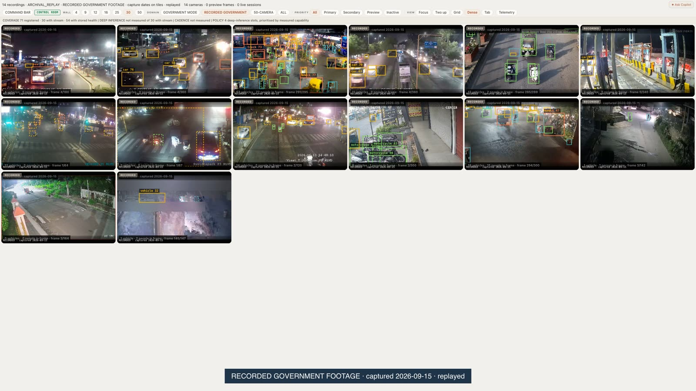

</div>

SAAKSHYA onboards any camera the state already owns (**Model 1**), reads the
live government grid (**Model 2**), federates departmental VMS systems
(**Model 3**) and runs deep central analytics only on the cameras that
measurably deserve it (**selected-camera Model 4**). Every vehicle sighting
becomes a timestamped, geolocated, hash-chained observation. Every search
needs a case and a stated purpose and lands in a tamper-evident audit log.
Every number here is labelled **MEASURED**, **MODELLED**, **DEMO** or
**DESIGNED**.

> **Judges — start here:** the [**v1.0 release**](../../releases) and the
> [`submission/`](submission/) folder hold everything we submitted.
> [`docs/FINAL_SUBMISSION.md`](docs/FINAL_SUBMISSION.md) says what each file
> proves, and what it does not.

---

## ▶ The films

<table>
<tr>
<td width="33%" valign="top"><a href="submission/films/03_own_feed_1080p.mp4">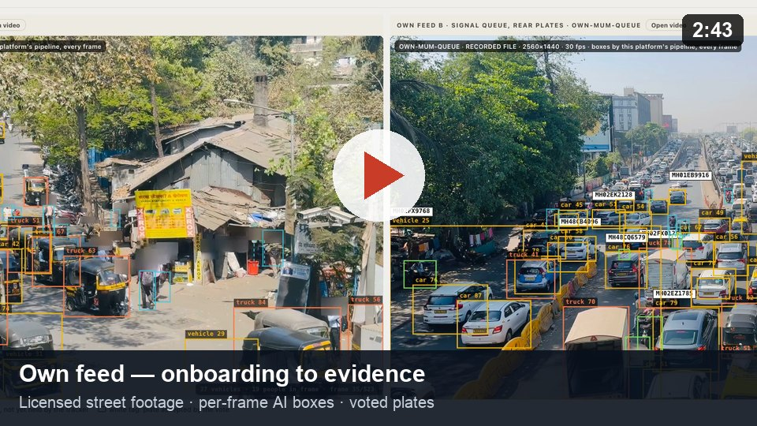</a><br><b>Own feed · 2:43</b><br><sub>Sign-in → onboarding → handoff → per-frame detection and voted plates → search → watchlist alert, route, trace report → evidence</sub></td>
<td width="33%" valign="top"><a href="submission/films/04_government_feed_1080p.mp4">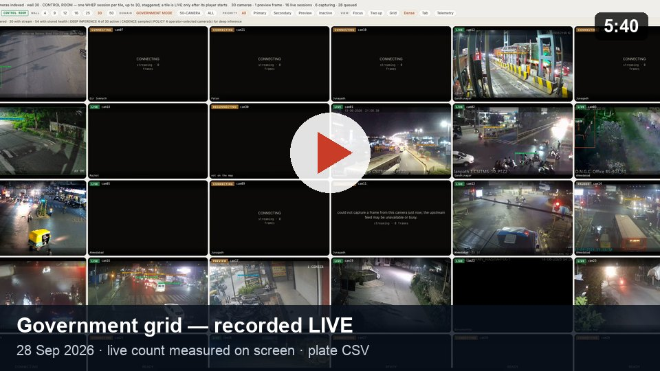</a><br><b>Government grid, live · 5:40</b><br><sub>Recorded live on Sentinel, 28 Sep 2026 12:41–12:47 IST, with the live count on screen · <a href="submission/04_government_feed_anpr_report.csv">plate CSV</a></sub></td>
<td width="33%" valign="top"><a href="submission/films/04b_government_tour_1080p.mp4">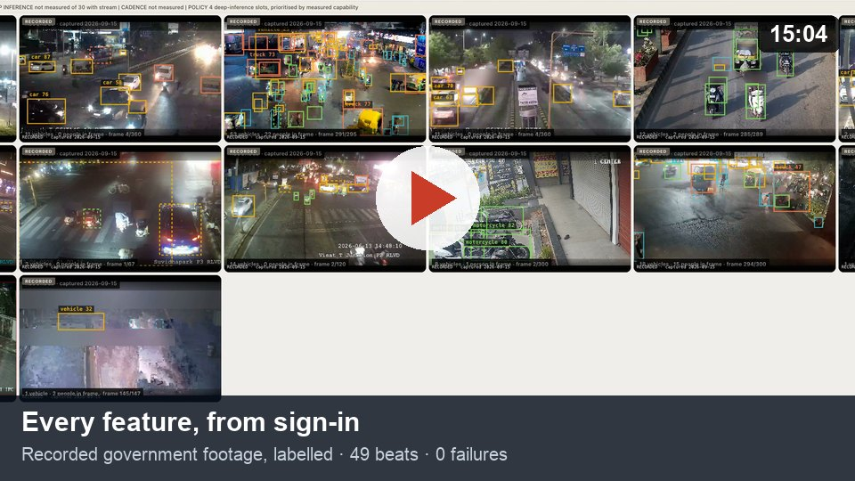</a><br><b>Every feature, from sign-in · 15:04</b><br><sub>All screens, 49 beats, 0 failures, on government footage recorded 15 Sep: labelled RECORDED, never called live</sub></td>
</tr>
</table>

<sub>1080p copies in <a href="submission/films/">submission/films/</a>; the 2560×1440 masters are in the submission pack.</sub>

---

## 🔢 Number-plate reads

Indian plates are read by **Awiros-ANPR-OCR** (PP-OCRv5 fine-tuned on
Indian plates, ported to PyTorch) behind a YOLOv9 plate detector. A plate
is published only when the frames of one track **agree** on it.

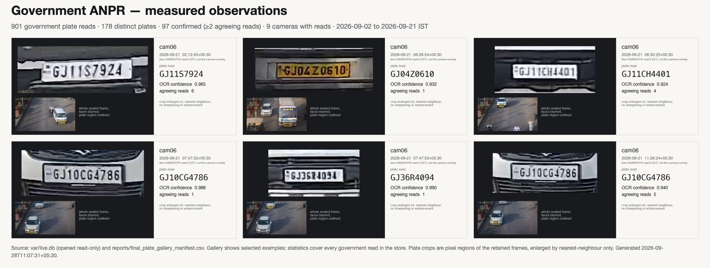

<sub><b>Government cam06, from the evidence store.</b> 901 reads · 178 distinct plates · 97 confirmed by ≥ 2 agreeing reads (to 24 Sep); 200 more read live on 28 Sep. Crops are pixel regions of sealed frames, faces blurred, enlarged without sharpening. Older sealed stills can show a different vehicle; verify each against its provenance.</sub>

<table>
<tr>
<td width="50%">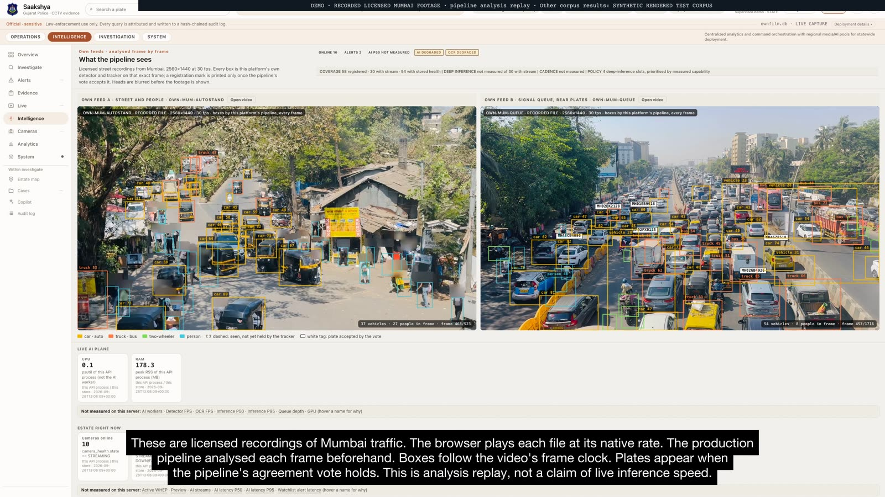<br><sub><b>Own feed:</b> every vehicle boxed; white plate tags only where the vote holds</sub></td>
<td width="50%">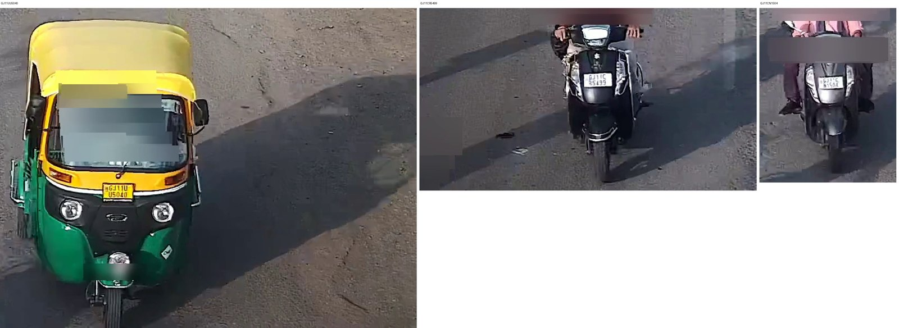<br><sub><b>Recorded government footage, cam06:</b> <code>GJ11UU5040</code>, <code>GJ11CR5499</code>, <code>GJ11CN1504</code>, each checked by eye against the frame</sub></td>
</tr>
</table>

| Recogniser test | Result |
|---|---|
| Hand-read plates, exact | **17 / 21** Awiros-ANPR-OCR · 5 / 21 Apple Vision · 2 / 21 ONNX |
| 57 s own-footage clip, final vote | 56 published: **40 correct**, 4 wrong, 12 not settled by a crop |
| Delivered government report | [**1,101 reads**](submission/04_government_feed_anpr_report.csv), 264 plates, 9 cameras, UTC + IST timestamps, recogniser named per row |

---

## 🖥 Inside the application

<table>
<tr>
<td width="50%">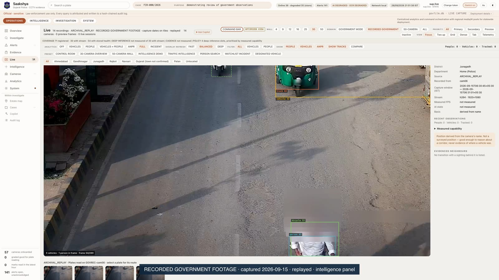<br><sub><b>Focus with provenance:</b> source domain, parent camera and capture window beside the picture</sub></td>
<td width="50%">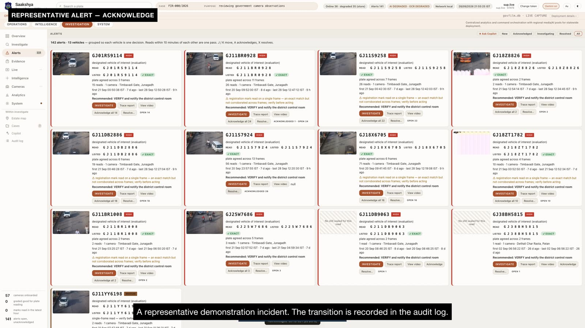<br><sub><b>Alerts:</b> reads grouped into one decision per vehicle; every transition audited</sub></td>
</tr>
<tr>
<td>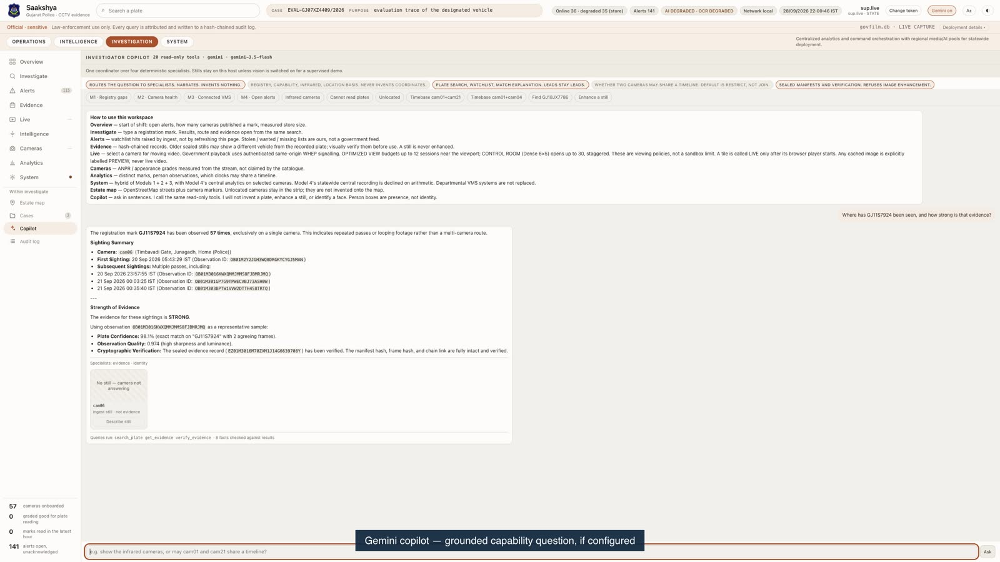<br><sub><b>Gemini copilot:</b> answers only from read-only tool results; 57 reads, one camera, no route invented</sub></td>
<td>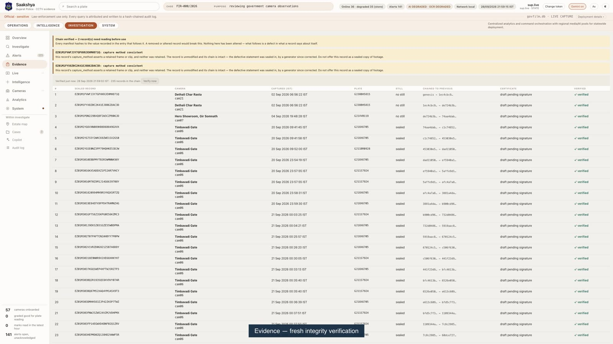<br><sub><b>Evidence:</b> 235 sealed records re-hashed on demand; cautions stated, never hidden</sub></td>
</tr>
<tr>
<td>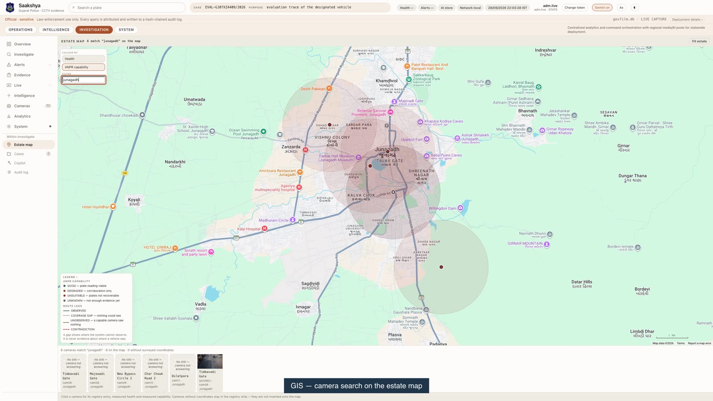<br><sub><b>Estate map:</b> camera search and ANPR-capability layer over the real registry</sub></td>
<td>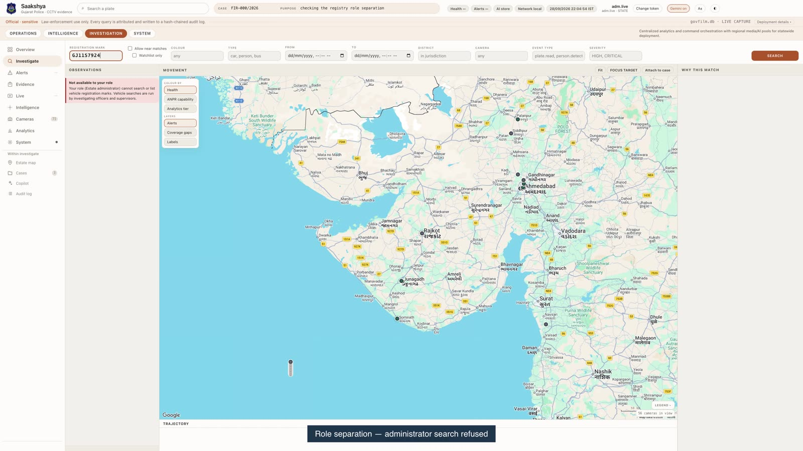<br><sub><b>Role separation:</b> the estate administrator cannot search plates; the server refuses</sub></td>
</tr>
</table>

---

## 📊 Results at a glance

| | Result | Label |
|---|---|---|
| **Live grid census** | All 30 documented government camera IDs produced RTSP frames in the 16 Sep source census (reachability, not a simultaneous wall) | MEASURED |
| **Live session, 28 Sep** | 6–13 of 30 cameras advancing at once on the shared sandbox; 4 deep-inference slots wrote **4,465** observations; **200** plate reads on cam06 | MEASURED |
| **Government store to 24 Sep** | **1,155,325** observations; persons on all 30 cameras, vehicles on 29; 901 plate reads | MEASURED |
| **Recorded government footage** | 15 clips analysed frame by frame: 3,159 frames, 1,319 tracks, 1,548 observations, kept apart as `ARCHIVAL_REPLAY` | MEASURED |
| **Statewide scale** | 80,000 cameras in 40 district cells + state DC + DR; only inference compute grows per analysed camera; 80k synthetic registry rows loaded and queried | MODELLED · MEASURED (synthetic) |
| **Quality** | **1,582 tests pass**, 0 fail; secret scan passes on every file and the full history | MEASURED |

**What we do not claim:** no government plate was read on two government
cameras, so there is no real multi-camera government route (route logic is
shown on a labelled synthetic corpus); no 80,000-camera live test was run;
the tour's footage is recorded, not live.

---

## 🏗 Architecture

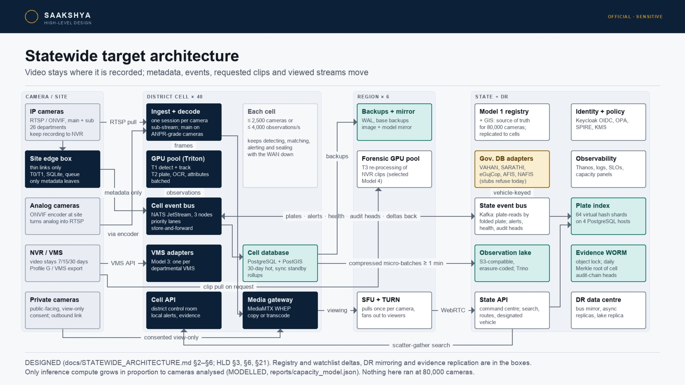

<table>
<tr>
<td width="50%"><br><sub><b>Logical architecture:</b> Models 1 + 2 + 3 with selected-camera Model 4</sub></td>
<td width="50%">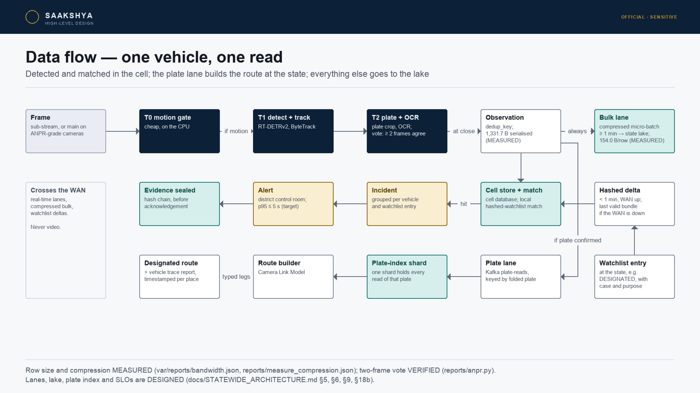<br><sub><b>One vehicle, one read:</b> detected in the cell, routed at the state</sub></td>
</tr>
</table>

Full design: [HLD](docs/HLD.md) · [statewide architecture](docs/STATEWIDE_ARCHITECTURE.md) · [all diagrams (PDF)](submission/02_HLD_diagrams.pdf) · [security](docs/SECURITY.md) · [scale model](docs/SCALE_MODEL.md).

---

## 📡 What it took to integrate the live grid

We measured the grid before building on it: all 30 camera IDs producing RTSP
frames, 15 reachable by direct WHEP, 15 needing an H.264 bridge. We asked
Sentinel for its concurrency guidance and rebuilt around the answer:

- direct WHEP through our authenticated signalling proxy;
- CONTROL ROOM and OPTIMIZED VIEW session policies;
- per-camera isolation with backoff;
- four prioritised deep-inference slots;
- truthful LIVE labels and recording gates that refuse to film a stall.

Eight recording attempts on 28 Sep produced the 5:40 live film. From 12:57
IST the grid rejected our credentials, so the full-feature tour was made
from footage we had captured on 15 Sep.
**[Read the full timeline, with the question we sent and Sentinel's answer →](docs/LIVE_INTEGRATION_STORY.md)**

---

## 📁 Submission files

| Portal item | File | Built by |
|---|---|---|
| 1 · Presentation | [`01_SAAKSHYA_deck.pdf`](submission/01_SAAKSHYA_deck.pdf) · [`.pptx`](submission/01_SAAKSHYA_deck.pptx) (50 slides) | `tools/demo/render_submission_deck.py` |
| 2 · High-level design | [HLD](docs/HLD.md) · [diagrams](submission/02_HLD_diagrams.pdf) · [statewide](docs/STATEWIDE_ARCHITECTURE.md) · [security](docs/SECURITY.md) | `tools/demo/render_diagrams.py` |
| 3 · Own-feed demo | [`03_own_feed_1080p.mp4`](submission/films/03_own_feed_1080p.mp4) | `tools/demo/record_own_feed.py` |
| 4 · Government demo + plate report | [`04_government_feed_1080p.mp4`](submission/films/04_government_feed_1080p.mp4) · [`04_government_feed_anpr_report.csv`](submission/04_government_feed_anpr_report.csv) | `tools/demo/record_government_feed.py` |
| 4b · Every feature | [`04b_government_tour_1080p.mp4`](submission/films/04b_government_tour_1080p.mp4) · [replay reads](submission/04b_government_tour_replay_reads.csv) · [beat record](submission/evidence/04b_government_tour_beats.json) | `--tour full --wall-domain replay` |
| Trace reports | [designated vehicle](submission/06_designated_vehicle_trace_report.html) · [synthetic route](submission/06_own_feed_trace_report.html) | `/reports/trace` |
| Models 1 & 3 reports | [`submission/reports/`](submission/reports/) | `reports/`, `docs/ADAPTERS.md` |
| Integration story | [`docs/LIVE_INTEGRATION_STORY.md`](docs/LIVE_INTEGRATION_STORY.md) | — |
| Certification | [`reports/FINAL_SUBMISSION_CERTIFICATION.md`](reports/FINAL_SUBMISSION_CERTIFICATION.md) | — |

---

## ✅ How this maps to the evaluation framework

| Criterion | Where the evidence is |
|---|---|
| **1. Successful test case** | Team-chosen stand-in `GJ11S7924` (not organiser-issued) on cam06: SINGLE-CAMERA evidence in the live film, the trace report and the tour. `GJ18JX7786` (C-014 → C-021): SYNTHETIC RENDERED TEST CORPUS, route logic only |
| **2. Solution presentation** | [Deck](submission/01_SAAKSHYA_deck.pdf) · [judge Q&A](docs/JUDGE_QA.md) |
| **3. Solution architecture** | [HLD](docs/HLD.md) · [statewide](docs/STATEWIDE_ARCHITECTURE.md) · statewide full-video centralisation declined on arithmetic (80k × 2 Mbps ≈ 160 Gbps; 30 days ≈ 52 PB) |
| **4. Working platform** | The three films · `make demo && make serve` · bearer-token gate · OpenAPI `/docs` |
| **5. Video analytics output** | Vehicle and person detection, tracking, voted ANPR, attribute search, zones, capability grades, CSV reports |
| **6. Scalability & PoC readiness** | [Scale model](docs/SCALE_MODEL.md) · [80k synthetic load test](submission/reports/05_SCALE_80K_LOAD_TEST.md) |
| **7. Submission completeness** | [`submission/`](submission/) · [release](../../releases) · [certification](reports/FINAL_SUBMISSION_CERTIFICATION.md) |

---

## Designated vehicles


| Store | What we show |
|---|---|
| **Live government** | Team-chosen stand-in `GJ11S7924` (not organiser-issued): 57 reads on cam06 only (52 to the 24 Sep snapshot, 5 read during the 28 Sep session, 11:15–12:53 IST; the film is 12:41–12:47 IST), SINGLE-CAMERA evidence. `GJ38BH5815` on cam21 is an evaluation-designated watchlist entry, not stolen (`reports/SUBMISSION_EVIDENCE_SNAPSHOT.md`). |
| **Synthetic rendered corpus** | `GJ18JX7786` on **C-014 then C-021** — SYNTHETIC RENDERED TEST CORPUS — route-logic demonstration, not camera footage (`reports/SUBMISSION_EVIDENCE_SNAPSHOT.md`) |

---

## High-level design

Departmental recording stays at source; metadata and selected viewing streams move.

Model 1 is compulsory: both source paths register identity, GIS and governance
there. **Model 2 connects directly** to reachable cameras/NVRs or departmental
systems over RTSP/ONVIF, without a federation middleware layer. **Model 3 uses
VMS federation middleware** between departmental VMS APIs/SDKs and the unified
platform. Transport adapters alone do not prove departmental VMS federation.
The connector contract and DEMO/TEST implementations are in `docs/ADAPTERS.md`;
no live departmental VMS integration is claimed. Selected central analytics
is the Model 4 part of this hybrid (official FAQ Q12–Q23).


<p align="center">
  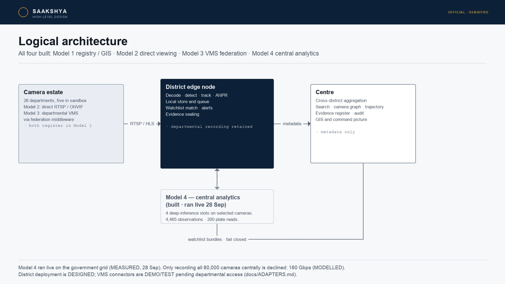
</p>

| Model | Role | Status |
|---|---|---|
| **1** Registry and GIS | Identity, geometry, health, measured capability | **Kept** |
| **2** Unified viewing | CONTROL ROOM up to 30 WHEP sessions / OPTIMIZED VIEW at most 12 (policy below) | **Kept** |
| **3** Federation | Departmental VMS adapters and metadata exchange; DEMO/TEST connectors (`docs/ADAPTERS.md`) | **Kept; live VMS access pending** |
| **4** Central analytics/VMS PoC | Selected-camera central ingest, analytics, events, watchlist, evidence, GIS | **Supported for selected feeds; not statewide full-video centralization** |

```
RTSP / HLS  →  INGEST (PyAV, real PTS)  →  ANALYTICS (T0 motion → T1 track → T2 ANPR)
        →  EDGE (local store, queue, watchlist)  →  STORE (SQLite ⇄ PostgreSQL + PostGIS)
        →  search / graph / trajectory / alerts / evidence / investigation workspace
```

**Model 2 media policies (VERIFIED, `ui/app.js`, `tileWhepBudget`).**
CONTROL ROOM (Dense 6×5) opens one direct WHEP session per tile, up to 30,
400 ms apart. OPTIMIZED VIEW (default scrolling wall) holds at most 12
sessions near the viewport, prefetches 600 px, and releases sessions 15 s
after leaving it. `#media-policy` names the active policy. Browser signalling
uses SAAKSHYA’s authenticated proxy; Sentinel credentials stay server-side.
Selected AI workers read RTSP/TCP separately. These are local viewing policies,
not sandbox limits or a claim that every tile is currently live.

Current demonstration hardware limits simultaneous deep-inference
concurrency. Analytics workers scale horizontally, so additional GPU nodes
raise concurrent inference throughput without redesigning ingest, event,
watchlist, GIS or investigation services.

The default is **4 deep-inference slots, prioritised by measured capability**
(VERIFIED in `src/saakshya/analytics/worker.py`, `SAAKSHYA_AI_CAMERA_LIMIT`).
At worker boot, stream-capable enabled cameras are ranked GOOD > DEGRADED >
UNKNOWN > UNSUITABLE by ANPR grade; ties use camera id. Assignments do not
rotate at runtime. This configured default is separate from the historical
four-camera measurement in `reports/SCALE_80K_LOAD_TEST.md`.
`command/summary.py` reports “N of M camera(s) with a stream under
analysis”. Integrated cameras remain available to the viewer and health
surfaces, subject to source availability. `AdaptiveInferenceScheduler` implements
priority cadence and is VERIFIED in the certification harness; `AnalyticsBudget` tier selection is unit-tested. Neither
is wired into the live worker (DESIGNED integration). The worker samples at a
fixed interval (`SAAKSHYA_AI_SAMPLE_S`, default 0.20 s); it does not rotate cameras.
GPU pool capacities in this proposal are **MODELLED/SIZED**, not measured cluster throughput.

The chain runs **with no language model in the loop** — a test fails if one is imported while it runs.

---

## Scalability and PoC readiness

| Framework ask | This design |
|---|---|
| Central / regional / edge | **District cell (40):** ingest + analytics + local store + durable queue, ≤ 2,500 cameras or ≤ 4,000 observations/s each. **Region (6):** viewing fan-out, backups, forensic GPUs. **State + DR:** registry, plate index, observation lake, cross-district search, evidence chain, audit. **DESIGNED**, sized in [docs/STATEWIDE_ARCHITECTURE.md](docs/STATEWIDE_ARCHITECTURE.md) (HLD §21) |
| GPU | The detector and the plate recogniser run on the GPU where there is one (Metal measured here; CUDA in deployment); plate detection stays on CPU (ONNX). Every stage has a CPU path, so a GPU is acceleration, not a requirement for the PoC |
| Bandwidth | Video stays at the camera. Metadata ~400 B MODELLED optimised payload vs 1,331.7 B MEASURED serialised row (`var/reports/bandwidth.json`); sizing uses 1,331.7 B raw and assumes 154.0 B compressed from a separate 1,230.6 B sample (8.0× on that sample’s base, effective 8.65× vs the raw base; `reports/measure_compression.json`, HLD §20.4): 82 Mbps statewide at a pessimistic rate, **MODELLED**. Central video at 80k × 2 Mbps ≈ **160 Gbps** — why statewide central recording is declined |
| Storage | Hot metadata (30 days) in each cell, compressed observations in a state lake, sealed evidence in a write-once store; video remains on departmental NVR/VMS |
| HA / ops | Edge continues with uplink down; SERVICE token sync; reconnect with exponential backoff; credentials from environment only |
| Cost | Quantities and indicative ranges from `tools/sizing/capacity_model.py` (HLD §20.8, §21) on ASSUMED unit rates for procurement to replace |

**MEASURED:** 30 government cameras onboarded (dated snapshot above); 50 local streams initially, 44 streaming / 6 down at end, 0 decoder errors (`var/reports/camera_load.json`); whole per-frame pipeline 598 → 293 ms at 2560×1440 on the laptop's GPU (2.0×, same 67 observations and no plates on either device in the 145-frame sample; `var/reports/pipeline_device.json`).
**MODELLED:** 40 district cells for 80k; only inference compute grows in proportion to cameras analysed (`tests/unit/test_capacity_model.py` pins this). Never quoted as tested.

---

## Technology stack

| Layer | Choice | Why |
|---|---|---|
| Ingest | **PyAV** (real PTS) | Wall-clock / declared FPS rejected for evidence time |
| Detect / track | **RT-DETRv2-R18** (Apache-2.0) on the GPU where there is one (Apple MPS measured 3.4×, same boxes) + ByteTrack + separate person pool | Persons never enter plate voting |
| ANPR | YOLOv9 plate detector (MIT) on **full-resolution tiles** of ≥1920 px frames; OCR by **Awiros-ANPR-OCR** (Apache-2.0, PP-OCRv5 fine-tuned on 558k Indian plates), **ported to PyTorch** so it runs on the GPU (6.6 ms a plate batched; matches PaddlePaddle to 7.5e-6); Apple Vision / CCT ONNX as fallbacks; Indian-format position typing; per-track vote | 17/21 hand-read plates exact against Vision's 5/21 and ONNX's 2/21 after format-position typing; on a whole clip the final vote publishes 56 marks, 40 checked correct and 4 wrong, against Vision's 17 correct and 6 wrong (`var/reports/ocr_indian_eval.json`); AGPL Ultralytics **rejected in code** |
| API | **FastAPI** + generated OpenAPI | Contract cannot drift from routes |
| Store | SQLAlchemy · SQLite ⇄ **PostgreSQL 18 + PostGIS 3.6** (`tools/db/setup_postgres.sh`) | Same schema, both exercised: the 1.19M-row government store copied with counts matching and both hash chains verifying; `/gis/near` on geography with a GiST index (`var/reports/store_engines.json`) |
| UI | Static investigation workspace (`ui/`) | No third-party CDN required for core use |
| Auth | Bearer `skv_…` + purpose headers | Case + purpose ≥ 12 chars on intrusive queries |
| Optional copilot | **Gemini over M1–M4**: 20 read-only tools (registry gaps, camera health, federated VMS, alert queue, search, trajectory, evidence…) | Every factual token grounded against tool results or the answer is withheld; refuses to enhance / invent stills |
| Beyond ANPR | Person long-stay reports; **restricted-zone entries** against a department's rule (polygon, IST hours, authority); printable **vehicle trace report** with sealed stills and a row digest | The platform never calls anyone an intruder on its own; the rule is the department's |

---

## Full reproduce — clone to working login

Requires **Python 3.12+**, [`uv`](https://github.com/astral-sh/uv), ~8 GB free for models on first analytics run.

### 1. Clone and install

```bash
git clone https://github.com/Eartherai/DAU-Daiict-submission-Sentinel-gujarat-Hackathone.git
cd DAU-Daiict-submission-Sentinel-gujarat-Hackathone

make install
# uv venv --python 3.12 && uv pip install -e ".[dev,analytics]"

cp .env.example .env   # never commit .env

tools/models/fetch_indian_ocr.sh   # optional: the Indian plate recogniser (~150 MB, checksum-pinned)
```

Without the Indian recogniser the pipeline falls back to Apple Vision (macOS) or the ONNX model.

### 2. Seed the demonstration store

```bash
make media    # synthetic corpus from a fixed seed
make demo     # isolated var/demo.db — never writes the evaluation store
```

`make demo` prints bearer tokens (`skv_…`) once for `supervisor.demo`, `investigator.ahd`, `operator.demo`, …  
**Copy one token from the terminal.** The seeder never writes tokens to disk.

### 3. Start API + workspace

```bash
make serve    # http://127.0.0.1:8080
```

### 4. Sign in (full login)

1. Open **http://127.0.0.1:8080/**
2. Gate asks for **Bearer token**, **Case**, **Purpose** (≥ 12 characters)
3. Example:
   - Token: paste from `make demo` (e.g. `supervisor.demo`)
   - Case: `FIR-214/2026`
   - Purpose: `tracing a vehicle reported stolen for demonstration`
4. Click **Enter the workspace**

Token stays in tab `sessionStorage` only. Case + purpose are written into a hash-chained audit log on every search. Missing purpose → `400 PURPOSE_REQUIRED`.

| Surface | URL |
|---|---|
| Workspace | http://127.0.0.1:8080/ |
| Swagger / OpenAPI UI | http://127.0.0.1:8080/docs |
| OpenAPI JSON | http://127.0.0.1:8080/openapi.json |
| Liveness | http://127.0.0.1:8080/healthz |

### 5. Verify the stack

```bash
make precommit   # lint + typecheck + unit + secret scan
make verify      # full blocking gate
curl -s http://127.0.0.1:8080/healthz
```

### 6. Optional: PostgreSQL + PostGIS

```bash
tools/db/setup_postgres.sh                                   # PostgreSQL 18 + PostGIS 3.6 in var/pg/, no admin rights, 127.0.0.1 only
python tools/db/migrate.py --from var/demo.db --to "$(cat var/pg/url)" --evidence-root var/demo_evidence   # copies, counts, verifies both hash chains
make serve DEMO_DB="$(cat var/pg/url)"                      # the same API on PostgreSQL
SAAKSHYA_TEST_PG_URL="$(cat var/pg/url)" pytest tests/postgres
```

---

## Against the real Sentinel government feed

Credentials belong in the **process environment only**. Never commit them.

```bash
export SENTINEL_GRID_EMAIL='your@email'
export SENTINEL_GRID_PASSWORD='XXXX-XXXX-XXXX'
# export SENTINEL_GRID_COOKIE='…'   # if catalogue needs a browser session

make live-profile
make live-ingest          # → var/live.db
make live-watch           # continuous 30-camera ingest
make live-serve
```

Mint a short-lived token against the live store:

```bash
.venv/bin/python - <<'PY'
from datetime import timedelta
from saakshya.security import TokenService, Role
from saakshya.store import Store
store = Store("sqlite:///var/live.db")
ts = TokenService(store)
ts.upsert_user("supervisor.live", Role.SUPERVISOR, display_name="Supervisor (live)")
print(ts.mint("supervisor.live", label="live", ttl=timedelta(hours=8)))
PY
```

Details: [`docs/SENTINEL_SANDBOX.md`](docs/SENTINEL_SANDBOX.md) · [`docs/GOVERNMENT_DATA_ACCESS_CHECKLIST.md`](docs/GOVERNMENT_DATA_ACCESS_CHECKLIST.md).

Every client forces **RTSP over TCP**. Timing uses **presentation timestamps**, never declared FPS.

---

## API integration

```http
Authorization: Bearer <token>
X-Case-Id: FIR-214/2026
X-Purpose: tracing a stolen vehicle for demonstration
```

Purpose-bound: `/search`, `/trajectory/*`, `/gis/trajectory/*`, `/watchlist`, `/targets/*/observations`, `/evidence/*/export`, …

### curl

```bash
TOKEN='skv_…'   # from make demo — do not commit

curl -s http://127.0.0.1:8080/me -H "Authorization: Bearer $TOKEN" | jq .
curl -s http://127.0.0.1:8080/overview -H "Authorization: Bearer $TOKEN" | jq .

curl -s 'http://127.0.0.1:8080/search?plate=GJ05AB1234' \
  -H "Authorization: Bearer $TOKEN" \
  -H "X-Case-Id: FIR-214/2026" \
  -H "X-Purpose: tracing a stolen vehicle for demonstration" | jq .

curl -s 'http://127.0.0.1:8080/trajectory/GJ05AB1234' \
  -H "Authorization: Bearer $TOKEN" \
  -H "X-Case-Id: FIR-214/2026" \
  -H "X-Purpose: tracing a stolen vehicle for demonstration" | jq .

curl -s http://127.0.0.1:8080/alerts -H "Authorization: Bearer $TOKEN" | jq .
curl -s 'http://127.0.0.1:8080/gis/cameras' -H "Authorization: Bearer $TOKEN" | jq .
```

### Python

```python
import httpx

BASE = "http://127.0.0.1:8080"
headers = {
    "Authorization": f"Bearer {token}",
    "X-Case-Id": "FIR-214/2026",
    "X-Purpose": "tracing a stolen vehicle for demonstration",
}

with httpx.Client(base_url=BASE, headers=headers, timeout=30.0) as client:
    me = client.get("/me").json()
    hits = client.get("/search", params={"plate": "GJ05AB1234"}).json()
    traj = client.get("/trajectory/GJ05AB1234").json()
```

### Errors (every layer)

```json
{"detail": {"code": "PURPOSE_REQUIRED",
            "message": "X-Case-Id and X-Purpose are required before this query runs"}}
```

| Code | Status | Meaning |
|---|---|---|
| `NOT_AUTHENTICATED` | 401 | Missing / unknown / expired token |
| `PERMISSION_DENIED` | 403 | Role lacks permission |
| `OUT_OF_JURISDICTION` | 403 | District outside scope |
| `PURPOSE_REQUIRED` | 400 | Case / purpose missing |
| `QUERY_TOO_BROAD` | 400 | Unfiltered estate scan refused |
| `BUSY` | 503 | Admission limit — refused, not queued |

### Integrate another system

| Need | Pattern |
|---|---|
| Onboard cameras | `make government-import` / catalogue → registry |
| Push edge observations | `POST /edge/{node}/events` (SERVICE token) |
| Pull watchlist | `GET /edge/watchlist/bundle` |
| Seal evidence | `POST /evidence/from-observation/{id}` → `/export` |
| Health | `/healthz` · `/readyz` · `/system/health` · `/metrics` |

Full surface: [`docs/API.md`](docs/API.md).

---

## What it does / what it is not

**Does:** ingest → observations → plate search → camera graph → trajectory → watchlist → alert → evidence → verification.

**Is not:**

- **Not production-ready** — no PKI, no encryption at rest, no per-principal rate limit, no formal pen-test
- **Not legally admissible** — BSA s.63 *draft* only; signing is for a person in charge and a court
- **Not face identification** — person boxes = presence; no FR identity on government data
- **Not “ANPR works on every night camera”** — grades say **UNSUITABLE** where geometry fails

---

## Troubleshooting

| Symptom | Fix |
|---|---|
| `make demo` fails on media | Run `make media` first; needs disk for synthetic clips |
| Gate refuses token | Re-run `make demo` — tokens expire; copy the new `skv_…` |
| `PURPOSE_REQUIRED` on `/search` | Send both `X-Case-Id` and `X-Purpose` (≥ 12 chars) |
| Empty Live tiles on demo store | Expected until corpus cameras are decoded; use Focus on C-014 / C-021 |
| Government RTSP 401 | Export `SENTINEL_GRID_EMAIL` + `SENTINEL_GRID_PASSWORD`; `@` in email must be URL-encoded in authorities |
| Models hang on first load | Set `SAAKSHYA_MODELS_OFFLINE=1` only after cache is warm; otherwise allow one hub fetch |
| Port in use | `PORT=8081 make serve` |
| Duplicate FFmpeg class warning (av + cv2) | Harmless log on macOS; decode stays on PyAV |

---

## Repository map

```
src/saakshya/
  ingest/  analytics/  live/  store/  intelligence/
  capability/  watchlist/  evidence/  investigation/
  gis/  api/  copilot/  security/
ui/                 investigation workspace
docs/               HLD, ADRs, measured results, portal guide
docs/readme/        GIFs, UI shots, detection stills (this README)
tools/              demo films, ingest, verification
tests/              unit · integration · e2e · security
.env.example        every setting name — no secrets
```

---

## Documentation

| Doc | Purpose |
|---|---|
| [ARCHITECTURE.md](docs/ARCHITECTURE.md) | How it is built |
| [HLD.md](docs/HLD.md) | Technical proposal |
| [API.md](docs/API.md) | Endpoints |
| [DATA_MODEL.md](docs/DATA_MODEL.md) | Schema |
| [SECURITY.md](docs/SECURITY.md) | Four gates |
| [PRIVACY.md](docs/PRIVACY.md) | Purpose limitation |
| [PERFORMANCE.md](docs/PERFORMANCE.md) | Latency / load |
| [SCALE_MODEL.md](docs/SCALE_MODEL.md) | Where it breaks first |
| [MEASURED_RESULTS.md](docs/MEASURED_RESULTS.md) | Quote sheet |
| [SENTINEL_SANDBOX.md](docs/SENTINEL_SANDBOX.md) | Live grid |
| [DEMO_SIMULATION.md](docs/DEMO_SIMULATION.md) | Isolated 30-channel archival replay demo |
| [JUDGE_QA.md](docs/JUDGE_QA.md) | Hard questions |
| [FINAL_RED_TEAM.md](docs/FINAL_RED_TEAM.md) | Attacks we ran on ourselves |
| [FINAL_SUBMISSION.md](docs/FINAL_SUBMISSION.md) | Authoritative upload index |

---

## Team · licence · credentials

**Institution:** DAU / DAIICT — Gujarat Police Innovation Challenge 2026 (Sentinel).

Human team owns architecture decisions, evidence claims, and portal submission. GitHub **Settings → Collaborators** lists human accounts only — no AI product as collaborator.

Dependencies are permissively licensed; the model router refuses non-permissive licences. **Ultralytics / BoxMOT (AGPL) are rejected.**

**No credential is in this repository.** Secret scan runs in `make verify`. Do not commit `.env`, Sentinel passwords, or `/tmp/saakshya-*-token.raw`.
