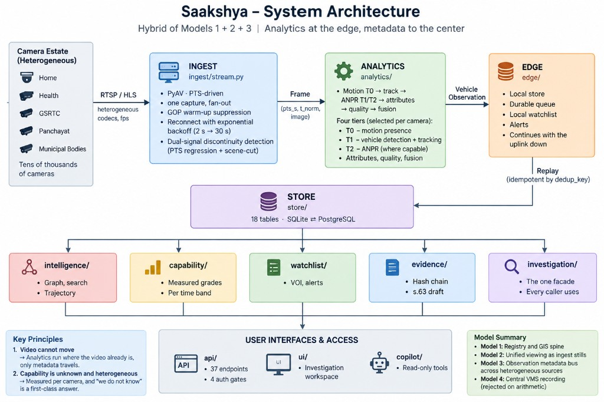

# SAAKSHYA

**साक्ष्य — *evidence***

Federated CCTV intelligence and evidence fabric for a camera estate that was never built to be one.

**Gujarat Police Innovation Challenge 2026** · Sentinel Camera Grid · DAU / DAIICT  
**Hybrid of Models 1 + 2 + 3.** Model 4 (central VMS of ~80,000 cameras) is **rejected on arithmetic**, not left unfinished.

[Repository](https://github.com/Eartherai/DAU-Daiict-submission-Sentinel-gujarat-Hackathone) · [Challenge](https://sentinel.gujarat.gov.in/) · [API OpenAPI](http://127.0.0.1:8080/docs) (after `make serve`) · [HLD](docs/HLD.md)

---

## Watch first (26 seconds)

Real Chrome tab against a live API — overview → government Focus → plates on the camera you opened.


**[▶ Download the 26-second dashboard cut (720p)](docs/readme/dashboard.mp4)**

Full narrated government workspace tour: `2.mp4` / portal pack `06_SAAKSHYA_launch.mp4`. Own-feed detection film: `1.mp4` / `03_own_feed.mp4`.

---

## What you get in one glance

| Surface | What the officer sees |
|---|---|
| **30-camera live wall** | Real government RTSP stills + selected live decode |
| **Detection overlays** | Vehicles, persons, bikes — same pipeline as the grid |
| **Find / trajectory** | Plate search with case + purpose, typed route legs |
| **Alerts** | Watchlist hits with confidence and acknowledge |
| **Capability grades** | Per-camera ANPR / appearance / presence — measured, not assumed |
| **Copilot** | 16 read-only tools; refuses to enhance government stills |
| **API** | Bearer auth, purpose binding, OpenAPI at `/docs` |

<p align="center">
  
</p>
<p align="center"><em>Live government wall. Unusable mounts stay dark — that is the estate, not a demo polish.</em></p>

---

## Detection that is actually drawn

Boxes come from the same `CameraPipeline` the live grid runs. White plate chips appear only when ANPR cleared two agreeing reads — not a single OCR guess.

### Government feed (night, organised grid)

<p align="center">
  
</p>
<p align="center"><em>cam01 · Chiman bhai Bridge — confirmed tracks, PTS-normalised time, live government feed.</em></p>

<p align="center">
  
</p>
<p align="center"><em>cam04 · Paldi Circle — 29 confirmed boxes on one frame. Marks stay zero when plate width is below the readable bar.</em></p>

<p align="center">
  
</p>

### Own feed (street CCTV — not government data)

<p align="center">
  
</p>
<p align="center"><em>OWN-STREET · own recording. Dense vehicle / person / bike boxes. Plate chips only after vote ≥ 2.</em></p>

---

## Investigation workspace

<p align="center">
  
</p>

<p align="center">
  
</p>
<p align="center"><em>Designated rehearsal plate <code>GJ1VV0119</code> — one camera, looping footage. Not a cross-camera fleet claim.</em></p>

<p align="center">
  
</p>

<p align="center">
  
</p>

<p align="center">
  
</p>
<p align="center"><em>Copilot refuses image enhancement. A “restored” plate would be fabricated evidence.</em></p>

---

## High-level design

Metadata moves. Video stays where it is. Model 4 is refused with a number.

<p align="center">
  
</p>

<p align="center">
  
</p>

| Model | Role | Status |
|---|---|---|
| **1** Registry and GIS | Identity, geometry, health, measured capability | **Kept** |
| **2** Unified viewing | One JPEG per camera from ingest; click → one extra stream | **Kept** |
| **3** Federation | Government RTSP + local media; observation store as bus | **Kept** |
| **4** Central VMS | Record ~80,000 cameras | **Not built** — 80k × 2 Mbps ≈ **160 Gbps**, 30-day ≈ **52 PB** |

```
RTSP / HLS  →  INGEST (PyAV, real PTS)  →  ANALYTICS (T0 motion → T1 track → T2 ANPR)
        →  EDGE (local store, queue, watchlist)  →  STORE (SQLite ⇄ PostgreSQL)
        →  search / graph / trajectory / alerts / evidence / investigation workspace
```

---

## Measured on the live government grid

Source: [`docs/MEASURED_RESULTS.md`](docs/MEASURED_RESULTS.md) · generated **2026-09-06T21:02:56Z**. Kept apart from modelled figures.

| | |
|---|---|
| Cameras onboarded | **30** of 30 issued |
| On the map / listed, not invented | **19** / **11** |
| Observations stored | **689,502** |
| Person observations (presence, not identity) | **178,757** |
| Distinct registration marks | **69** |
| Confirmed plates (votes ≥ 2) / single-frame leads | **74** / **43** |
| Exact cross-camera repeats | **0** |
| ANPR grades | **0 GOOD · 28 UNSUITABLE · 2 UNKNOWN** |
| Appearance | **20 GOOD · 8 DEGRADED · 2 UNKNOWN** |
| Concurrent cameras (mixed codecs) | 50 cameras — 52,637 frames, **0 decoder errors** |
| Analytics throughput (one process) | **11.4** frames/s |
| Hot queries using an index | **10 of 10** |

We do **not** say “tested at 80,000”. Measured at thirty of the issued grid (and fifty in load), designed for eighty thousand. Night ANPR **UNSUITABLE** is a geometry finding, not a failed reader.

### Designated vehicles (what we will show)

| Store | What we show |
|---|---|
| **Live government** | Rehearse `GJ1VV0119` (cam07, looping). Open alert `GJ38BH5815` on cam21 |
| **Own-feed corpus** | Cross-camera `GJ05AB1234` / `GJ35BV6925` on C-014 + C-021 |

---

## Full reproduce — clone to working login

Requires **Python 3.12+**, [`uv`](https://github.com/astral-sh/uv), ~8 GB free for models on first analytics run.

### 1. Clone and install

```bash
git clone https://github.com/Eartherai/DAU-Daiict-submission-Sentinel-gujarat-Hackathone.git
cd DAU-Daiict-submission-Sentinel-gujarat-Hackathone

make install
# equivalent:
#   uv venv --python 3.12
#   uv pip install -e ".[dev,analytics]"
```

Optional film tooling only: `uv pip install -e ".[demo]"` then `playwright install chromium`.

Copy environment template (no secrets in the repo):

```bash
cp .env.example .env
# edit .env only on your machine — never commit it
```

### 2. Seed the demonstration store (prints sign-in tokens once)

```bash
make media       # synthetic corpus from a fixed seed
make demo        # isolated var/demo.db — never writes the evaluation store
```

`make demo` prints a table of bearer tokens (`skv_…`) for roles such as `supervisor.demo`, `investigator.ahd`, `operator.demo`. **Copy one token from the terminal.** Tokens are shown once and are never written to disk by the seeder.

### 3. Start the API + investigation workspace

```bash
make serve       # http://127.0.0.1:8080
```

Open **http://127.0.0.1:8080/**.

### 4. Sign in (full login)

1. The gate asks for a **Bearer token**, a **Case** id, and a **Purpose** (≥ 12 characters).
2. Paste the token from `make demo` (e.g. `supervisor.demo`).
3. Example case / purpose for local use:
   - Case: `FIR-214/2026`
   - Purpose: `tracing a vehicle reported stolen for demonstration`
4. Click **Enter the workspace**.

The token stays in `sessionStorage` for that browser tab only. Case and purpose are written into a hash-chained audit log with every search. A search without purpose is refused with `400 PURPOSE_REQUIRED`.

Interactive API docs (same token): **http://127.0.0.1:8080/docs** · schema **http://127.0.0.1:8080/openapi.json**

### 5. Verify the stack

```bash
make precommit      # lint + typecheck + unit + secret scan
make verify         # full blocking gate
curl -s http://127.0.0.1:8080/healthz
```

---

## Against the real Sentinel government feed

Stream credentials belong in the **process environment only**. Never commit them.

```bash
export SENTINEL_GRID_EMAIL='your@email'
export SENTINEL_GRID_PASSWORD='XXXX-XXXX-XXXX'

# optional: catalogue cookie if cameras.json needs a browser session
# export SENTINEL_GRID_COOKIE='…'

make live-profile          # characterise reachable cameras
make live-ingest           # staged ingest into var/live.db
make live-watch            # continuous 30-camera ingest
make live-serve            # workspace on the live store (port 8080)
```

Mint a short-lived token against the live store (on the host that holds `var/live.db`):

```bash
.venv/bin/python - <<'PY'
from datetime import timedelta
from saakshya.security import TokenService, Role
from saakshya.store import Store
store = Store("sqlite:///var/live.db")
ts = TokenService(store)
ts.upsert_user("supervisor.live", Role.SUPERVISOR, display_name="Supervisor (live)")
print(ts.mint("supervisor.live", label="live", ttl=timedelta(hours=8)))
PY
```

Sign in at the gate with that token. Details: [`docs/SENTINEL_SANDBOX.md`](docs/SENTINEL_SANDBOX.md), [`docs/GOVERNMENT_DATA_ACCESS_CHECKLIST.md`](docs/GOVERNMENT_DATA_ACCESS_CHECKLIST.md).

Every client forces **RTSP over TCP**. Timing uses **presentation timestamps**, never declared FPS.

---

## API integration

All investigation routes need:

```http
Authorization: Bearer <token>
X-Case-Id: FIR-214/2026
X-Purpose: tracing a stolen vehicle for demonstration
```

Purpose-bound surfaces: `/search`, `/trajectory/*`, `/gis/trajectory/*`, `/watchlist`, `/targets/*/observations`, `/evidence/*/export`, …

### Quick curl examples

```bash
TOKEN='skv_…'   # from make demo — do not commit

# Who am I
curl -s http://127.0.0.1:8080/me \
  -H "Authorization: Bearer $TOKEN" | jq .

# Overview KPIs
curl -s http://127.0.0.1:8080/overview \
  -H "Authorization: Bearer $TOKEN" | jq .

# Plate search (purpose required)
curl -s 'http://127.0.0.1:8080/search?plate=GJ05AB1234' \
  -H "Authorization: Bearer $TOKEN" \
  -H "X-Case-Id: FIR-214/2026" \
  -H "X-Purpose: tracing a stolen vehicle for demonstration" | jq .

# Trajectory hypotheses
curl -s 'http://127.0.0.1:8080/trajectory/GJ05AB1234' \
  -H "Authorization: Bearer $TOKEN" \
  -H "X-Case-Id: FIR-214/2026" \
  -H "X-Purpose: tracing a stolen vehicle for demonstration" | jq .

# Alerts
curl -s http://127.0.0.1:8080/alerts \
  -H "Authorization: Bearer $TOKEN" | jq .

# GIS cameras (bbox optional)
curl -s 'http://127.0.0.1:8080/gis/cameras' \
  -H "Authorization: Bearer $TOKEN" | jq .

# Edge sync (SERVICE token only — edge:sync permission)
curl -s -X POST http://127.0.0.1:8080/edge/node01/events \
  -H "Authorization: Bearer $EDGE_TOKEN" \
  -H "Content-Type: application/json" \
  -d '{"events":[]}'
```

### Python client sketch

```python
import httpx

BASE = "http://127.0.0.1:8080"
headers = {
    "Authorization": f"Bearer {token}",
    "X-Case-Id": "FIR-214/2026",
    "X-Purpose": "tracing a stolen vehicle for demonstration",
}

with httpx.Client(base_url=BASE, headers=headers, timeout=30.0) as client:
    me = client.get("/me").json()
    hits = client.get("/search", params={"plate": "GJ05AB1234"}).json()
    traj = client.get("/trajectory/GJ05AB1234").json()
```

### Error shape (every layer)

```json
{"detail": {"code": "PURPOSE_REQUIRED",
            "message": "X-Case-Id and X-Purpose are required before this query runs"}}
```

| Code | Status | Meaning |
|---|---|---|
| `NOT_AUTHENTICATED` | 401 | Missing / unknown / revoked token |
| `PERMISSION_DENIED` | 403 | Role lacks the permission |
| `OUT_OF_JURISDICTION` | 403 | District outside caller scope |
| `PURPOSE_REQUIRED` | 400 | Case / purpose missing on a bound route |
| `QUERY_TOO_BROAD` | 400 | Unfiltered estate scan refused |
| `BUSY` | 503 | Admission limit — refused, not queued |

Full surface: [`docs/API.md`](docs/API.md) · live OpenAPI at `/docs`.

### Integrating another system

| Need | Endpoint / pattern |
|---|---|
| Onboard cameras | Import catalogue → registry; see `make government-import` |
| Push edge observations | `POST /edge/{node}/events` with a SERVICE token |
| Pull watchlist to edge | `GET /edge/watchlist/bundle` |
| Raise watchlist entries | `POST /watchlist` (purpose-bound read) |
| Seal evidence | `POST /evidence/from-observation/{id}` then `/export` |
| Health / readiness | `GET /healthz`, `/readyz`, `/system/health`, `/metrics` |

---

## What it does / what it is not

**Does:** ingest → observations → plate search → camera graph → trajectory → watchlist → alert → evidence → verification — with **no language model in the chain** (a test fails if one is imported while it runs).

**Is not:**

- **Not production-ready.** No PKI, no encryption at rest, no per-principal rate limit, no formal pen-test.
- **Not legally admissible.** Evidence supports a BSA s.63 *draft*; signing is for a person in charge and a court.
- **Not face identification.** Person boxes = presence. No FR identity on government data.
- **Not a claim that ANPR works on every night camera.** Grades say otherwise.

Forbidden submission phrases (enforced in docs and review): *production ready* · *legally admissible* · *tested at 80,000*.

---

## Repository map

```
src/saakshya/
  ingest/        PyAV, real PTS, one capture, fan-out
  analytics/     motion, tracker, ANPR, attributes, quality
  live/          grid, stills, selected live-view, timebase
  store/         tables, SQLite ⇄ PostgreSQL
  intelligence/  graph search, trajectory
  capability/    measured grades per time band
  watchlist/     VOI, automated alerts
  evidence/      hash chain, BSA s.63 draft
  investigation/ facade every caller uses
  gis/           estate map; unlocated cameras listed
  api/           FastAPI routes, four authorisation gates
  copilot/       read-only tools; Gemini optional
  security/      purpose binding, scoped access
ui/              investigation workspace
docs/            architecture, HLD, ADRs, measured results
docs/readme/     images used above (UI + detection stills)
tools/           demo films, ingest, verification
tests/           unit, integration, e2e, security
```

---

## Documentation

| Doc | Purpose |
|---|---|
| [ARCHITECTURE.md](docs/ARCHITECTURE.md) | How it is built, and why |
| [HLD.md](docs/HLD.md) | Technical proposal |
| [API.md](docs/API.md) | Endpoints; OpenAPI at `/openapi.json` |
| [DATA_MODEL.md](docs/DATA_MODEL.md) | Schema, two dialects |
| [SECURITY.md](docs/SECURITY.md) | Threat model, four gates |
| [PRIVACY.md](docs/PRIVACY.md) | Purpose limitation; why no FR identity |
| [PERFORMANCE.md](docs/PERFORMANCE.md) | Latency, query plans, load |
| [SCALE_MODEL.md](docs/SCALE_MODEL.md) | Where it breaks first |
| [MEASURED_RESULTS.md](docs/MEASURED_RESULTS.md) | Numbers quoted on slides |
| [SENTINEL_SANDBOX.md](docs/SENTINEL_SANDBOX.md) | Consuming the live grid |
| [JUDGE_QA.md](docs/JUDGE_QA.md) | Hard questions, answered |
| [PORTAL_UPLOAD.md](docs/PORTAL_UPLOAD.md) | Portal pack and forbidden phrases |

---

## Team

**Institution:** DAU / DAIICT — Gujarat Police Innovation Challenge 2026 (Sentinel).

Human team owns architecture decisions, evidence claims, and portal submission. GitHub collaborators are human accounts under **Settings → Collaborators** only. No AI product is listed as a repository collaborator. Grid passwords and bearer tokens are never committed.

---

## Licence and credentials

Dependencies are permissively licensed; the model router refuses a non-permissive licence and `make verify` fails on one. Ultralytics / BoxMOT (AGPL) are **rejected**.

**No credential is in this repository.** A secret scan over tracked files and git history runs in `make verify`. Do not commit `.env`, Sentinel passwords, or `/tmp/saakshya-*-token.raw`.
