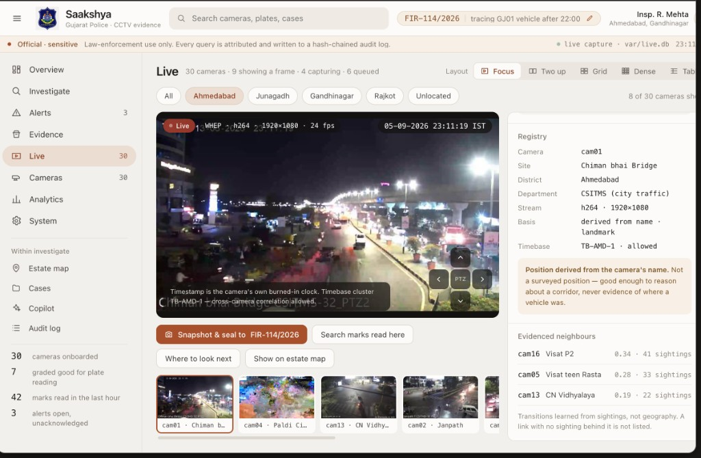
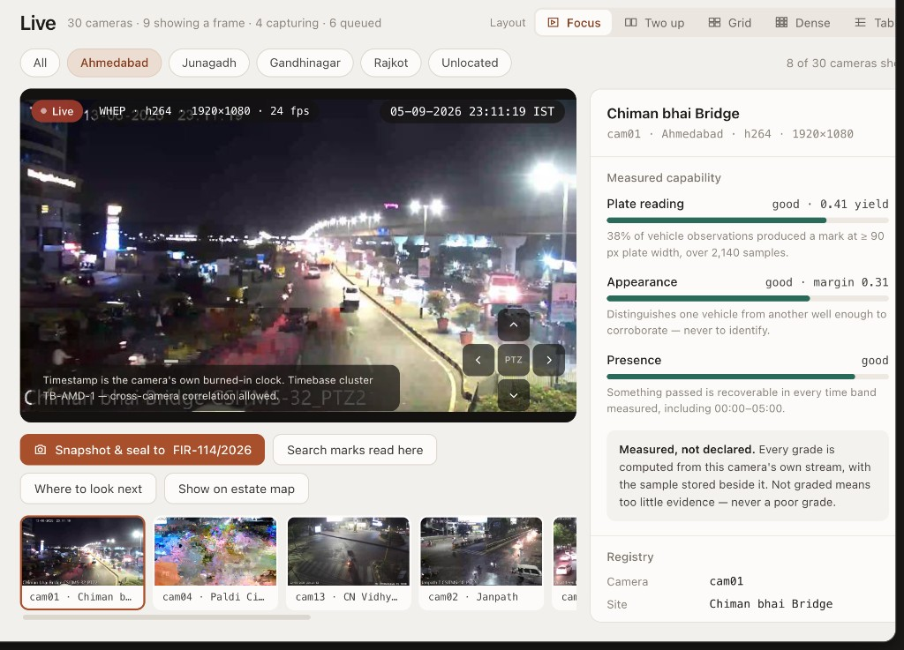
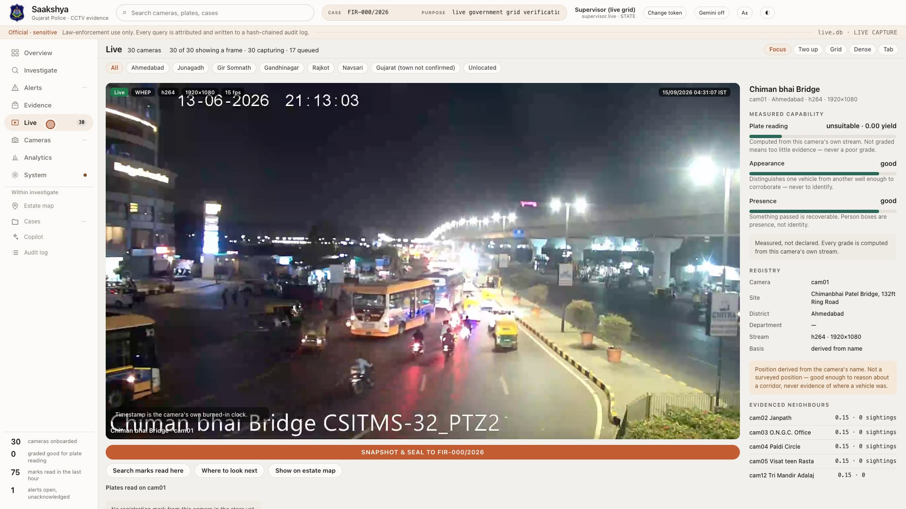
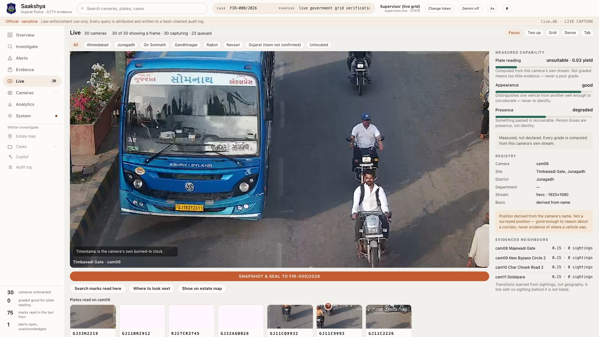
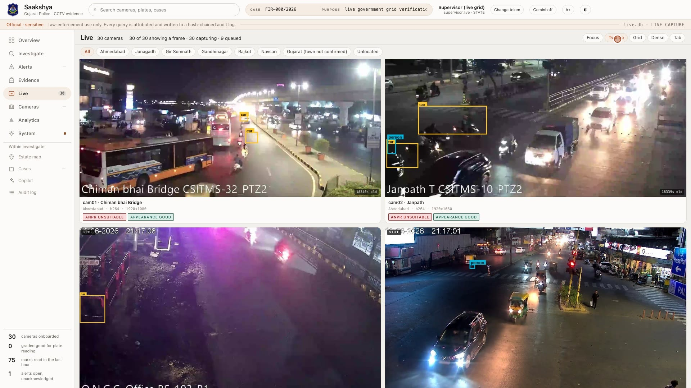
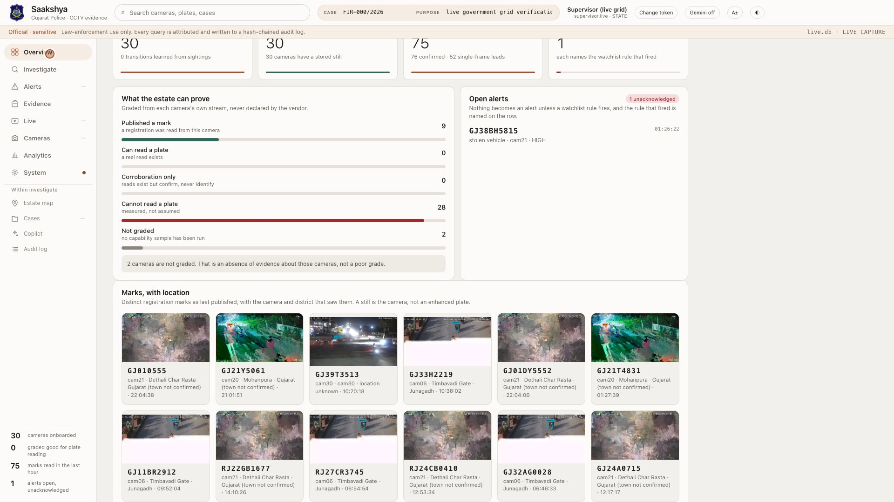
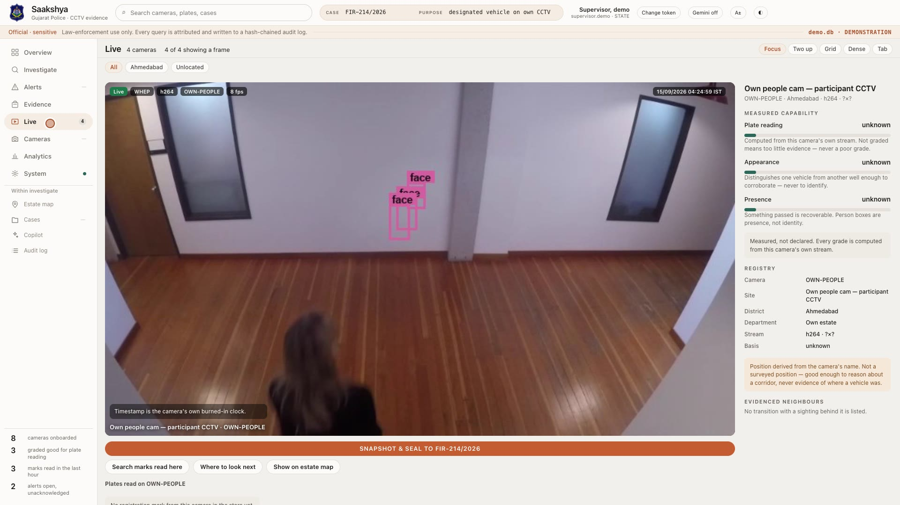
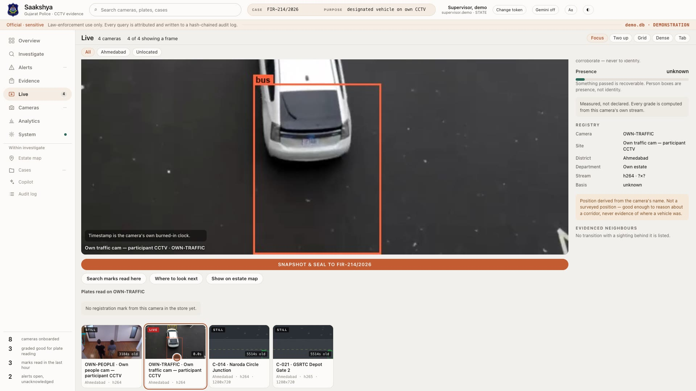

# SAAKSHYA

**साक्ष्य — *evidence***

Federated CCTV intelligence and evidence fabric for a camera estate that was never built to be one.

**Gujarat Police Innovation Challenge 2026** · Sentinel Camera Grid sandbox · DAU / DAIICT submission  
**Hybrid of Models 1 + 2 + 3.** Model 4 (central VMS of ~80,000 cameras) is **rejected on arithmetic**, not left unfinished.

[Repository](https://github.com/Eartherai/DAU-Daiict-submission-Sentinel-gujarat-Hackathone) · Challenge: [sentinel.gujarat.gov.in](https://sentinel.gujarat.gov.in/)

---

## Watch the workspace (26 seconds)

Overview KPIs → live government Focus (Chiman bhai Bridge, Ahmedabad) → plates read on the camera you opened.


**[▶ Download the 26-second dashboard cut (720p, 2.1 MB)](docs/readme/dashboard.mp4)**

The GIF and the cut are the real Chrome tab against a live API. Nothing is a mock-up. The full narrated tour is `var/demo/SAAKSHYA_launch.mp4` (about 12 minutes).

---

## High-level design

The two diagrams below are the submitted shape: metadata moves, video stays where it is, Model 4 is refused with a number.

<p align="center">
  
</p>

<p align="center"><em>SAAKSHYA — federated CCTV intelligence and evidence fabric. Hybrid of Models 1 + 2 + 3. Model 4 rejected on arithmetic.</em></p>

<p align="center">
  
</p>

<p align="center"><em>Analytics at the edge. Metadata to the centre. Video stays where it is.</em></p>

---

## Live government workspace

Onboarded cameras from the Sentinel sandbox. Focus is one extra stream copy when an officer clicks a camera — not thirty extra clients on the organiser's grid.

<p align="center">
  
</p>

<p align="center">
  
</p>

<p align="center">
  
</p>

<p align="center">
  
</p>

<p align="center">
  
</p>

<p align="center">
  
</p>

Focus shows the **crop and the number of every mark that camera published**. The operator picks one. There is no drawn-on licence-plate graphic.

---

## Own feed (local corpus)

Own CCTV is a **demonstration store**, not the government grid. People and vehicles are boxed from this store. Person / face boxes are **presence, not identity**. There is no face recognition pipeline on government data.

<p align="center">
  
</p>

<p align="center">
  
</p>

Cross-camera plates exist here by construction: **`GJ05AB1234`** and **`GJ35BV6925`** on **C-014** and **C-021**. The live government store has **zero exact cross-camera repeats**.

---

## The problem

Gujarat operates tens of thousands of cameras installed by Home, Health, GSRTC, Panchayat and Municipal bodies, over two decades, for local supervision — a gate, a ward, a bus stand. Most were never installed to read a registration number, and **nobody has a list of which ones can**.

An investigator's question is *"where did this vehicle go?"*. Two facts shape every answer:

1. **Video cannot be centralised.** 80,000 cameras at 2 Mbps is **160 Gbps** sustained and **~52 PB** for 30 days. Metadata is ~400 bytes per observation.
2. **Capability is unknown and unequal.** A system that assumes otherwise returns nothing from half the estate and never says why.

## What it does

```
ingest → observations → plate search → camera graph → trajectory
       → watchlist → alert → evidence → verification
```

That chain runs end to end with **no language model in the loop** — a test fails if one is even imported while it runs.

On top of it: a GIS layer, an investigation workspace, case files with audit trails, measured per-camera capability, offline operation that loses nothing, and an optional read-only copilot.

| Layer | What the officer sees |
|---|---|
| **Overview** | Cameras onboarded, how many are showing a frame, marks in the last hour, alerts still open |
| **Live** | Focus / two-up / grid / dense / table. Ingest stills on the wall. One extra decode when a tile is clicked |
| **Investigate** | Find a mark. Every candidate carries the basis of the match |
| **Map** | OpenStreetMap streets. Nineteen placed. Eleven listed, not invented onto the map |
| **Cameras** | ANPR / appearance / presence graded from that camera's own stream |
| **Alerts** | Representative watchlist. A match in ingest raises an alert. Not a government list |
| **Evidence** | Hash-chained. BSA s.63 stays `DRAFT_PENDING_SIGNATURE` |
| **Copilot** | Sixteen read-only tools. Gemini on or off in the masthead. Stills are never enhanced |

## The three ideas worth arguing about

**Capability is measured, not assumed.** Three independent grades per camera — can it read a plate, can it tell one vehicle from another, can it tell us something passed — measured from the camera's own stream, with the evidence stored beside the grade. A camera with too little evidence is `UNKNOWN`, never `UNSUITABLE`: silence is not failure.

**Absence of evidence is not evidence of absence.** Trajectory legs are typed `OBSERVED` / `UNOBSERVED` / `COVERAGE_GAP` / `CONTRADICTION`. A gap says the system could not observe; it never says the vehicle was elsewhere.

**Intrusive queries are accountable.** A vehicle search requires a case identifier and a written purpose, refused at the authorisation gate before any data is read, both written into a hash-chained audit log.

## Submitted architecture

| Model | Role | Status |
|---|---|---|
| **1** Registry and GIS | Identity, geometry, transport, health, measured capability | **Kept.** Mandatory |
| **2** Unified viewing | One JPEG per camera already decoded by ingest. Click → one extra stream copy | **Kept as stills + selected live** |
| **3** Federation | Government RTSP + local media. Observation store is the metadata bus | **Kept** |
| **4** Central VMS | Record ~80,000 cameras in one hall | **Not built.** 80,000 × 2 Mbps ≈ 160 Gbps |

Only metadata moves. Video stays where it is.

```
RTSP / HLS  →  INGEST (PyAV, real PTS)  →  ANALYTICS (T0 motion → T1 track → T2 ANPR)
        →  EDGE (local store, queue, watchlist)  →  STORE (18 tables, SQLite ⇄ PostgreSQL)
        →  search / graph / trajectory / alerts / evidence / investigation workspace
```

## Measured on the live government grid

Kept apart from modelled figures. Source: [`docs/MEASURED_RESULTS.md`](docs/MEASURED_RESULTS.md) generated **2026-09-06T21:02:56Z**.

| | |
|---|---|
| Cameras onboarded | **30** of 30 issued |
| On the map / listed, not invented | **19** / **11** |
| Observations stored | **689,502** |
| Person observations (presence, not identity) | **178,757** |
| Distinct registration marks | **69** |
| Confirmed plates (votes ≥ 2) / single-frame leads | **74** / **43** |
| Cameras that published a mark | **9** |
| Exact cross-camera repeats | **0** |
| ANPR grades | **0 GOOD · 28 UNSUITABLE · 2 UNKNOWN** |
| Appearance | **20 GOOD · 8 DEGRADED · 2 UNKNOWN** |
| Presence | **27 GOOD · 3 DEGRADED** |
| Concurrent cameras, mixed codecs | 50 cameras — 52,637 frames, **0 decoder errors** |
| Analytics throughput, one process | **11.4** frames/s |
| Hot queries using an index | **10 of 10** |

We do not say "tested at 80,000". Measured at thirty of the issued grid (and fifty in load), designed for eighty thousand.

Night ANPR **UNSUITABLE** is a geometry finding, not a failed reader. Cameras that nevertheless published a mark show that count beside the grade.

## Designated vehicle

| Store | What we will show |
|---|---|
| **Live government grid** | Rehearse `GJ1VV0119` (one camera, looping footage — not a fleet). Open alert `GJ38BH5815` stolen-vehicle HIGH on cam21 |
| **Own-feed corpus** | Identify + two-camera route + watchlist: `GJ05AB1234` / `GJ35BV6925` on C-014 and C-021 |

We will not substitute the synthetic corpus for the live store.

## What it is not

- **Not production-ready.** No PKI, no encryption at rest, no rate limiting per principal, no retention job, no formal penetration test.
- **Not legally admissible.** Evidence is prepared to support a BSA s.63 certificate. Signing and admissibility are for a person in charge, an expert, and a court.
- **Not face identification.** No FR identity on government data. Own-feed may draw a face box labelled as presence.
- **Not a claim that ANPR works on every night camera.** It does not. The grade says so.
- **Scores are ordering scores**, and every response carrying one says so.

A test asserts the phrase "legally admissible" appears nowhere in any export.

## Run it

```bash
git clone https://github.com/Eartherai/DAU-Daiict-submission-Sentinel-gujarat-Hackathone.git
cd DAU-Daiict-submission-Sentinel-gujarat-Hackathone

make install     # uv venv + editable install
make media       # render the synthetic corpus from a fixed seed
make demo        # seed an isolated store; prints sign-in tokens once
make serve       # http://127.0.0.1:8080
```

Demonstration state lives in `var/demo.db`. The seeder **refuses** to write to the evaluation store — a demo must never be able to improve a measured result.

```bash
make verify         # every blocking gate
make release-check  # everything, blocking and advisory
make loadtest       # concurrent camera simulation
make queryplan      # EXPLAIN over the hot queries
```

### Against the real feed

Stream credentials belong in the **process environment only**. They are never written into this repository.

```bash
make government-profile CATALOGUE=http://<host>/api/ingest
make government-run     CATALOGUE=http://<host>/api/ingest
make live-serve         # workspace over sqlite:///var/live.db
```

See [`docs/GOVERNMENT_DATA_ACCESS_CHECKLIST.md`](docs/GOVERNMENT_DATA_ACCESS_CHECKLIST.md) and [`docs/SENTINEL_SANDBOX.md`](docs/SENTINEL_SANDBOX.md).

Every client forces **RTSP over TCP**. Timing is driven from **presentation timestamps**, never from declared frame rate. Reconnect uses exponential backoff (2 s, cap 30 s). Mixed H.264 / H.265, mixed resolutions, no fixed-shape batch.

## Repository map

```
src/saakshya/
  ingest/        PyAV, real PTS, one capture, fan-out
  analytics/     motion, tracker, ANPR, attributes, quality
  live/          grid, stills, selected live-view, timebase
  store/         18 tables, SQLite ⇄ PostgreSQL
  intelligence/  graph search, trajectory
  capability/    measured grades per time band
  watchlist/     representative VOI, automated alerts
  evidence/      hash chain, BSA s.63 draft
  investigation/ the one facade every caller uses
  gis/           estate map, unlocated cameras listed
  api/           37 endpoints, four authorisation gates
  copilot/       read-only tools; Gemini optional
  security/      purpose binding, scoped access
ui/              investigation workspace (Overview, Live, Find, Map, …)
docs/            architecture, HLD, ADRs, measured results
docs/readme/     images and the 26-second dashboard cut used above
tools/           demo films, ingest, verification
tests/           unit, integration, e2e, security
```

## Documentation

| | |
|---|---|
| [ARCHITECTURE.md](docs/ARCHITECTURE.md) | How it is built, and why |
| [HLD.md](docs/HLD.md) | Technical proposal |
| [API.md](docs/API.md) | 37 endpoints; OpenAPI at `/openapi.json` |
| [DATA_MODEL.md](docs/DATA_MODEL.md) | 18 tables, one schema, two dialects |
| [SECURITY.md](docs/SECURITY.md) | Threat model and four authorisation gates |
| [PRIVACY.md](docs/PRIVACY.md) | Purpose limitation, minimisation, why no FR identity |
| [PERFORMANCE.md](docs/PERFORMANCE.md) | Measured latency, query plans, load |
| [SCALE_MODEL.md](docs/SCALE_MODEL.md) | Where it breaks first |
| [MEASURED_RESULTS.md](docs/MEASURED_RESULTS.md) | Numbers quoted on slides, with artefacts |
| [SENTINEL_SANDBOX.md](docs/SENTINEL_SANDBOX.md) | How we consume the live camera grid |
| [JUDGE_QA.md](docs/JUDGE_QA.md) | The hard questions, answered |
| [FINAL_RED_TEAM.md](docs/FINAL_RED_TEAM.md) | Attacks we ran on ourselves |
| [CODE_REVIEW_LOG.md](docs/CODE_REVIEW_LOG.md) | Every defect found, with severity |
| [PORTAL_UPLOAD.md](docs/PORTAL_UPLOAD.md) | Submission pack and forbidden phrases |

## Team and AI collaboration

**Institution:** DAU / DAIICT — Gujarat Police Innovation Challenge 2026 (Sentinel).

This repository was built as a **human + AI collaboration**. Cursor (agent pair-programming) is treated as a collaborator on architecture, the investigation workspace, live ingest, films, and this README — not as an author of evidence, and not as a substitute for a human who must state a case and a purpose before a search.

GitHub collaborator invites still require a GitHub username. Add the human team under **Settings → Collaborators**. AI does not hold a login, does not hold grid passwords, and does not appear in the audit log as an officer.

## Licence and credentials

Dependencies are permissively licensed and the policy is enforced in code — the model router refuses a non-permissive licence and `make verify` fails on one.

**No credential is in this repository**, and a secret scan over tracked files *and full git history* runs in `make verify`. Do not commit `.env`, Sentinel passwords, or `/tmp/saakshya-*-token.raw`.
