# SAAKSHYA

**साक्ष्य — *evidence***

Federated CCTV intelligence and evidence fabric for a camera estate that was never built to be one.

[](https://sentinel.gujarat.gov.in/)
[](docs/HLD.md)
[](https://python.org)
[](docs/API.md)
[](#verify-the-stack)
[-6A1B9A?style=flat-square)](docs/THIRD_PARTY_LICENSES.md)

**Gujarat Police Innovation Challenge 2026** · Sentinel Camera Grid · **DAU / DAIICT**  
**Hybrid of Models 1 + 2 + 3, with selected-camera Model 4 central analytics.**
The evaluation baseline is **30 GOVERNMENT + 2 OWN_FEED + 18
SYNTHETIC_CONTROL = 50** (`src/saakshya/command/domain.py`,
`enforce_evaluation_50`). Operator-onboarded cameras are retained, so a runtime
registry can exceed that baseline. Government availability is measured during
a test window; onboarding does not establish simultaneous viewing or inference. Full statewide centralization of ~80,000
cameras remains rejected on arithmetic — 80k × 2 Mbps ≈ **160 Gbps**, 30-day
≈ **52 PB** — while selected-camera central analytics is supported.

[Live README images](#watch-first-26-seconds) · [HLD](docs/HLD.md) · [Measured results](docs/MEASURED_RESULTS.md) · [API](docs/API.md) · [Submission index](docs/FINAL_SUBMISSION.md) · [Judge Q&A](docs/JUDGE_QA.md)

---

## Contents

- [Watch first (26 seconds)](#watch-first-26-seconds)
- [Official submission deliverables](#official-submission-deliverables)
- [How this maps to the evaluation framework](#how-this-maps-to-the-evaluation-framework)
- [Detection that is actually drawn](#detection-that-is-actually-drawn)
- [Investigation workspace](#investigation-workspace)
- [Measured on the live government grid](#measured-on-the-live-government-grid)
- [High-level design](#high-level-design)
- [Scalability and PoC readiness](#scalability-and-poc-readiness)
- [Technology stack](#technology-stack)
- [Full reproduce — clone to working login](#full-reproduce--clone-to-working-login)
- [Against the real Sentinel government feed](#against-the-real-sentinel-government-feed)
- [API integration](#api-integration)
- [What it does / what it is not](#what-it-does--what-it-is-not)
- [Troubleshooting](#troubleshooting)
- [Repository map](#repository-map)
- [Documentation](#documentation)
- [Team · licence · credentials](#team--licence--credentials)

---

## Watch first (26 seconds)

Real Chrome tab against a live API — overview → government Focus → plates on the camera you opened. Nothing here is a mock-up.

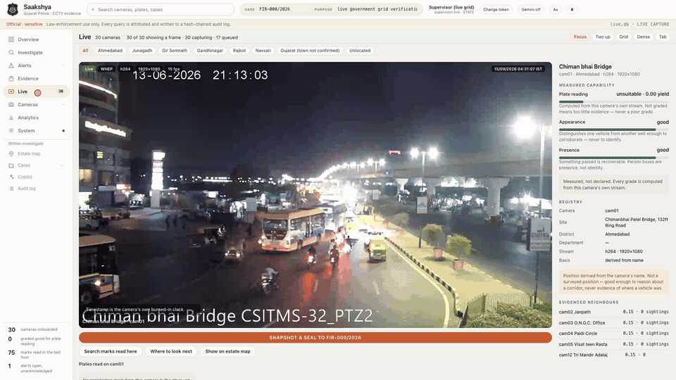

**[▶ Download the 26-second dashboard cut (720p)](docs/readme/dashboard.mp4)**

| Film | What it is |
|---|---|
| **Own feed** `03_own_feed.mp4` | Onboarding, detection, watchlist and alerts; 2:53 (`var/demo/own_feed.mp4`, ffprobe) |
| **Government workspace** `04_government_feed.mp4` | Re-recorded — duration stamped at pack build; single-camera designated vehicle evidence |
| **Detection overlays** | Same `CameraPipeline` drawn onto government + own frames |

<p align="center">
  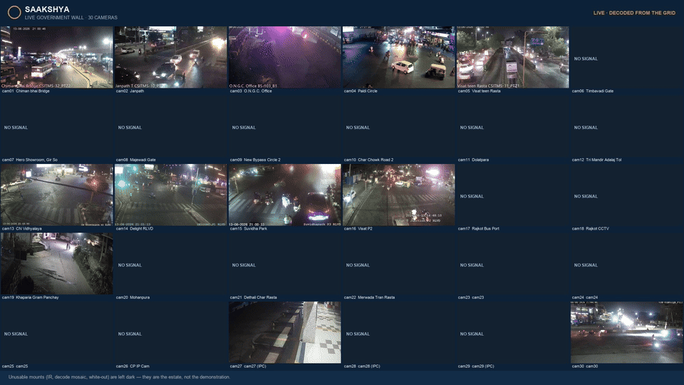
</p>
<p align="center"><em>30-camera live government wall. Unusable mounts stay dark — that is the estate, not demo polish.</em></p>

---

**Older sealed-still limitation.** A content hash verifies unchanged bytes,
not that the image shows the vehicle named by its plate record. The older
worker sealed the frame in hand when a track closed; that frame can show a
different vehicle. Treat older stills as requiring visual/source verification,
including those in historical trace reports and films. Since commit `672a2a0` the worker
seals the frame each plate was best read from, so new captures show the read
vehicle's frame; stills sealed before it are unchanged. See `reports/SUBMISSION_EVIDENCE_SNAPSHOT.md`.

## Official submission deliverables

Upload `var/demo/SUBMIT/`, built by `python tools/demo/build_submission_pack.py`. The authoritative file list and submission instructions are in [docs/FINAL_SUBMISSION.md](docs/FINAL_SUBMISSION.md). Confirm the current deadline on the portal; large binaries are gitignored.

| Portal field | Artefact | In-repo pointer |
|---|---|---|
| **1 · Presentation** | `01_SAAKSHYA_deck.pptx` + `.pdf` | Rendered by `tools/demo/render_submission_deck.py` |
| **2 · High-level design** | `docs/HLD.md` + architecture diagrams | [docs/HLD.md](docs/HLD.md) · [docs/readme/hld-fabric.jpg](docs/readme/hld-fabric.jpg) |
| **3 · Own-feed demo** | `03_own_feed.mp4` (2:53; source above) | Still: [docs/readme/detect/own-street.jpg](docs/readme/detect/own-street.jpg) |
| **4 · Government-feed demo** | `04_government_feed.mp4` + `04_government_feed_anpr_report.csv` | Stills: [docs/readme/detect/](docs/readme/detect/) |
| **Working platform** | This repository · `make demo && make serve` | Steps below |

Forbidden phrases on every slide and in this README: *production ready* · *legally admissible* · *tested at 80,000*.

---

## How this maps to the evaluation framework

| Criterion | Where the evidence is |
|---|---|
| **1. Successful test case** | Government designated vehicle `GJ11S7924` on cam06: SINGLE-CAMERA evidence. `GJ18JX7786` on C-014 then C-021: CONTROLLED OWN-FEED MULTI-CAMERA DEMONSTRATION (`reports/SUBMISSION_EVIDENCE_SNAPSHOT.md`). Chain: ingest → observation → search → trajectory → watchlist → alert → evidence |
| **2. Solution presentation** | Portal deck PPTX/PDF · content from measured sheet · [docs/JUDGE_QA.md](docs/JUDGE_QA.md) |
| **3. Solution architecture** | [docs/HLD.md](docs/HLD.md) · [docs/ARCHITECTURE.md](docs/ARCHITECTURE.md) · 10 ADRs · Statewide Model 4 recording declined on bandwidth arithmetic; selected-camera Model 4 analytics kept |
| **4. Working platform & demonstration** | `make install && make media && make demo && make serve` → http://127.0.0.1:8080 · bearer gate · OpenAPI `/docs` |
| **5. Video analytics output** | Vehicle + person detection, tracking, per-track ANPR with voting, capability grades, CSV/JSON paired to overlay films |
| **6. Scalability & PoC readiness** | [Scalability section](#scalability-and-poc-readiness) · [docs/SCALE_MODEL.md](docs/SCALE_MODEL.md) · dated 30-camera government registry snapshot + 50 local streams initially / 44 at end (`var/reports/camera_load.json`) · **MODELLED** 80k sizing kept separate |
| **7. Submission completeness** | This README, `.env.example`, the test suite (`make test`), portal pack checklist, secret scan in `make verify` |

| Bonus ask | What is built |
|---|---|
| Hybrid architecture | Models **1 + 2 + 3** plus selected-camera Model **4** central analytics; statewide full-video centralization refused |
| Cross-camera correlation | Graph + trajectory with typed legs (`OBSERVED` / `UNOBSERVED` / `COVERAGE_GAP`); government cameras: **0** exact cross-camera plate repeats (`reports/SUBMISSION_EVIDENCE_SNAPSHOT.md`) |
| Analytics beyond ANPR | Motion / track / person presence / attributes / measured capability |
| Edge + low bandwidth | Metadata ~400 B MODELLED optimised payload vs 1,331.7 B MEASURED serialised row (`var/reports/bandwidth.json`); sizing uses the measured row; video stays at the camera; edge queue + SERVICE token sync |
| Security / privacy / audit | Four authorisation gates · purpose binding · hash-chained audit · no FR identity on government data |
| Dashboards / alerts / APIs | Overview · Live · Find · Map · Alerts · Copilot (refuses enhancement) · OpenAPI |

---

## Detection that is actually drawn

Boxes come from the same `CameraPipeline` the live grid runs. A white plate chip appears only when ANPR cleared **two agreeing reads** — not a single OCR guess.

### Government feed (night, organised grid)

<p align="center">
  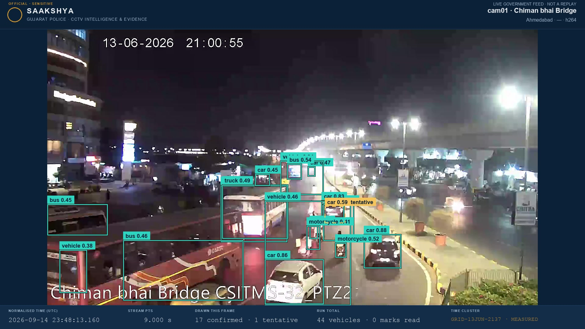
</p>
<p align="center"><em>cam01 · Chiman bhai Bridge — confirmed tracks, PTS-normalised time, live government feed.</em></p>

<p align="center">
  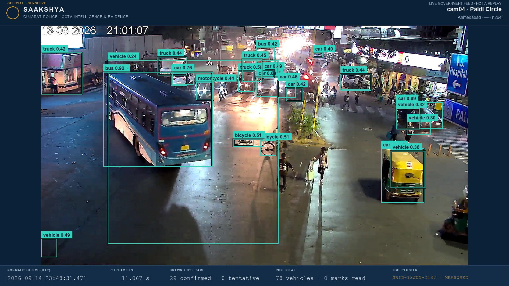
</p>
<p align="center"><em>cam04 · Paldi Circle — 29 confirmed boxes. Marks stay zero when plate width is below the readable bar.</em></p>

<p align="center">
  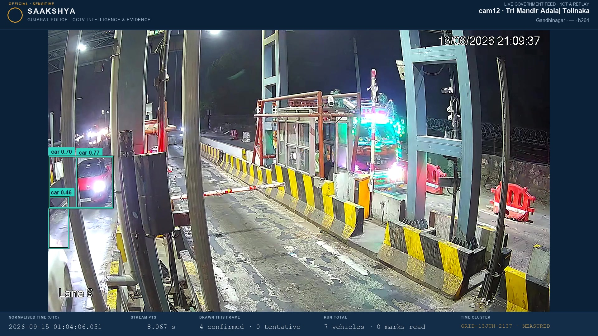
</p>

<p align="center">
  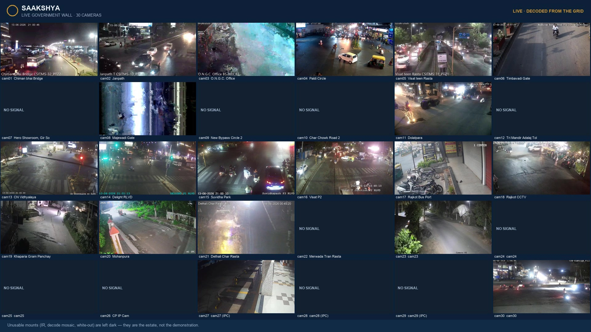
</p>

### Own feed (street CCTV — not government data)

<p align="center">
  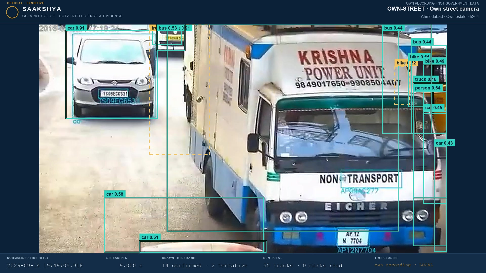
</p>
<p align="center"><em>OWN-STREET · own recording. Dense vehicle / person / bike boxes. No fabricated plate chips.</em></p>

---

## Investigation workspace

<p align="center">
  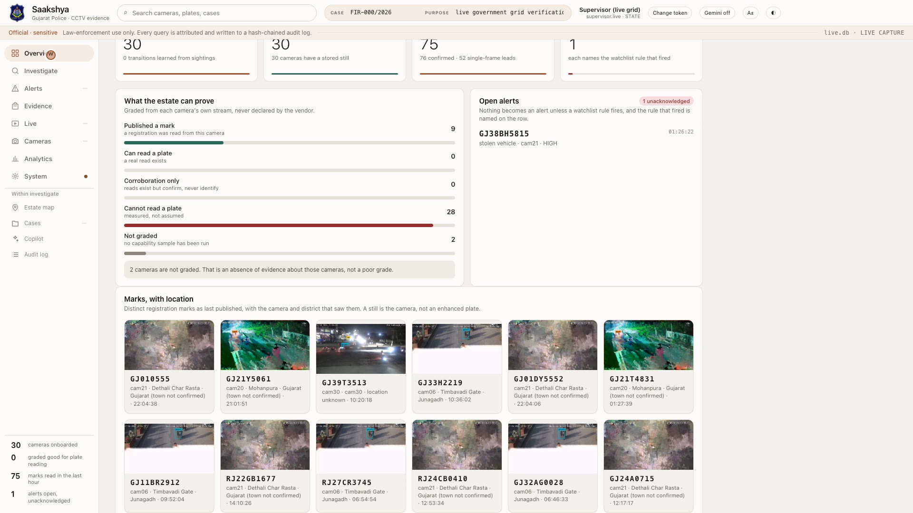
</p>

<p align="center">
  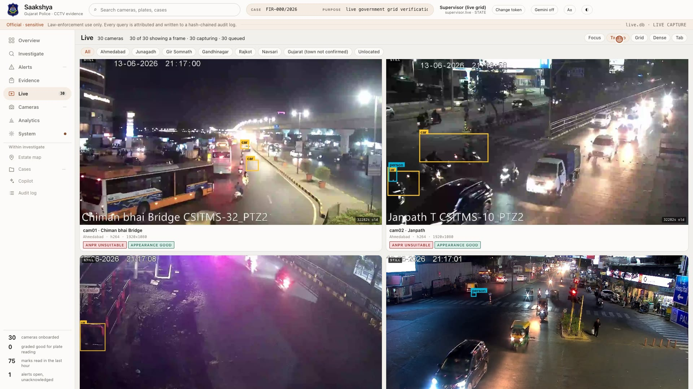
</p>

<p align="center">
  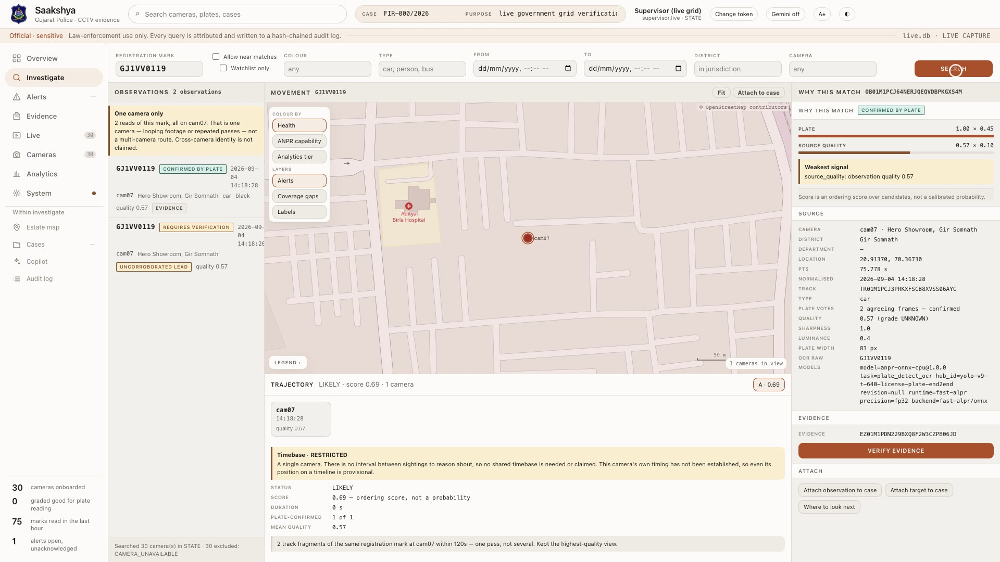
</p>
<p align="center"><em>Historical rehearsal screenshot: <code>GJ1VV0119</code> — one camera, looping footage. Not a cross-camera fleet claim.</em></p>

<p align="center">
  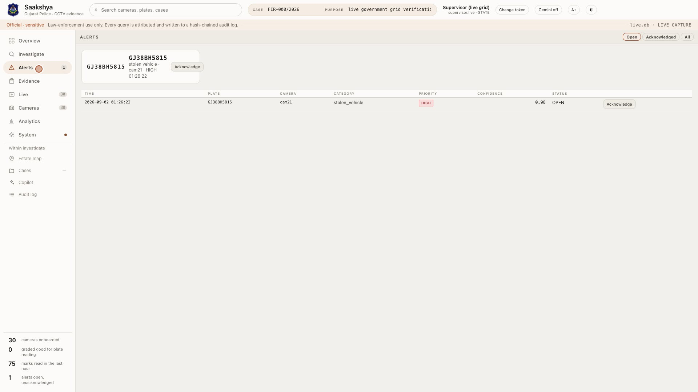
</p>

<p align="center">
  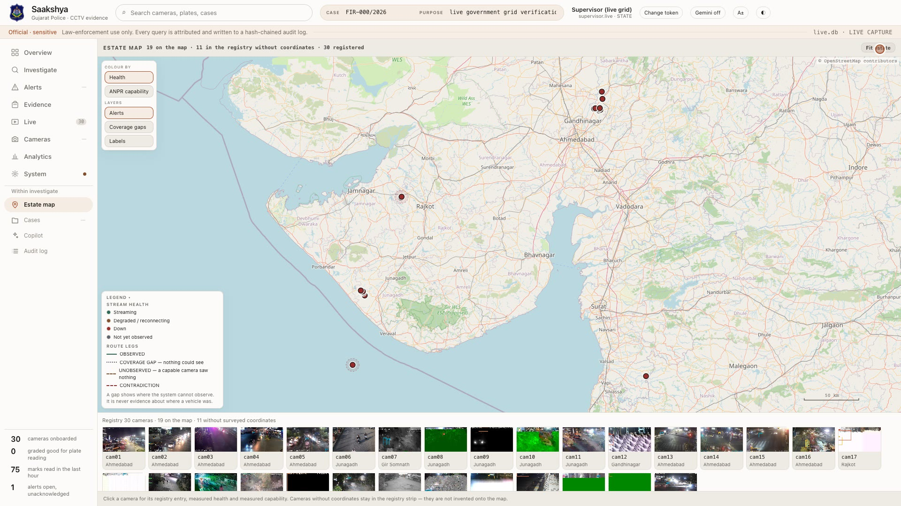
</p>

<p align="center">
  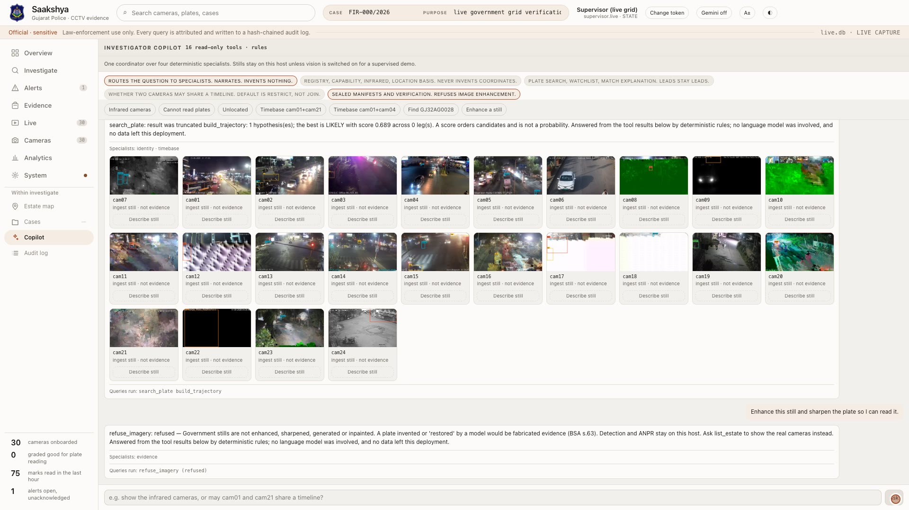
</p>
<p align="center"><em>Copilot refuses image enhancement. A “restored” plate would be fabricated evidence (BSA s.63).</em></p>

---

## Measured on the live government grid

Source: [`docs/MEASURED_RESULTS.md`](docs/MEASURED_RESULTS.md) · generated **2026-09-06T21:02:56Z**.  
**MEASURED** figures are never mixed with **MODELLED** 80k sizing.

| | |
|---|---|
| Cameras onboarded | **30 government registry entries in this dated snapshot**; baseline composition is stated above |
| On the map / listed, not invented | **19** / **11** |
| Observations stored | **689,502** |
| Person observations (presence, not identity) | **178,757** |
| Distinct registration marks | **69** |
| Confirmed plates (votes ≥ 2) / single-frame leads | **74** / **43** |
| Exact cross-camera repeats | **0** |
| ANPR grades | **0 GOOD · 28 UNSUITABLE · 2 UNKNOWN** |
| Appearance | **20 GOOD · 8 DEGRADED · 2 UNKNOWN** |
| Concurrent cameras (mixed codecs) | 50 local streams initially; 44 streaming / 6 down at end · 52,637 frames · **0** decoder errors (`var/reports/camera_load.json`) |
| Analytics throughput (local replica harness, one process) | **11.4** frames/s (`var/reports/camera_load.json`; not a current government-worker benchmark) |
| Hot queries using an index | **10 of 10** |
| Automated checks | Run the test suite (`make test`); current count is stamped at submission |

We do **not** say “tested at 80,000”. Night ANPR **UNSUITABLE** is a geometry finding (plate width / mount), not a failed reader.

### Designated vehicles (what we will show)

| Store | What we show |
|---|---|
| **Live government** | `GJ11S7924`: 52 reads on cam06 only, SINGLE-CAMERA evidence. `GJ38BH5815` on cam21 is an evaluation-designated watchlist entry, not stolen (`reports/SUBMISSION_EVIDENCE_SNAPSHOT.md`). |
| **Own-feed corpus** | `GJ18JX7786` on **C-014 then C-021** — CONTROLLED OWN-FEED MULTI-CAMERA DEMONSTRATION (`reports/SUBMISSION_EVIDENCE_SNAPSHOT.md`) |

---

## High-level design

Departmental recording stays at source; metadata and selected viewing streams move.

Model 1 is compulsory: both source paths register identity, GIS and governance
there. **Model 2 connects directly** to reachable cameras/NVRs or departmental
systems over RTSP/ONVIF, without a federation middleware layer. **Model 3 uses
VMS federation middleware** between departmental VMS APIs/SDKs and the unified
platform. Transport adapters alone do not prove departmental VMS federation.
The connector contract and DEMO/TEST implementations are in `docs/ADAPTERS.md`;
no live departmental VMS integration is claimed. Selected central analytics
is the Model 4 part of this hybrid (official FAQ Q12–Q23).


<p align="center">
  
</p>

| Model | Role | Status |
|---|---|---|
| **1** Registry and GIS | Identity, geometry, health, measured capability | **Kept** |
| **2** Unified viewing | CONTROL ROOM up to 30 WHEP sessions / OPTIMIZED VIEW at most 12 (policy below) | **Kept** |
| **3** Federation | Departmental VMS adapters and metadata exchange; DEMO/TEST connectors (`docs/ADAPTERS.md`) | **Kept; live VMS access pending** |
| **4** Central analytics/VMS PoC | Selected-camera central ingest, analytics, events, watchlist, evidence, GIS | **Supported for selected feeds; not statewide full-video centralization** |

```
RTSP / HLS  →  INGEST (PyAV, real PTS)  →  ANALYTICS (T0 motion → T1 track → T2 ANPR)
        →  EDGE (local store, queue, watchlist)  →  STORE (SQLite ⇄ PostgreSQL + PostGIS)
        →  search / graph / trajectory / alerts / evidence / investigation workspace
```

**Model 2 media policies (VERIFIED, `ui/app.js`, `tileWhepBudget`).**
CONTROL ROOM (Dense 6×5) opens one direct WHEP session per tile, up to 30,
400 ms apart. OPTIMIZED VIEW (default scrolling wall) holds at most 12
sessions near the viewport, prefetches 600 px, and releases sessions 15 s
after leaving it. `#media-policy` names the active policy. Browser signalling
uses SAAKSHYA’s authenticated proxy; Sentinel credentials stay server-side.
Selected AI workers read RTSP/TCP separately. These are local viewing policies,
not sandbox limits or a claim that every tile is currently live.

Current demonstration hardware limits simultaneous deep-inference
concurrency. Analytics workers scale horizontally, so additional GPU nodes
raise concurrent inference throughput without redesigning ingest, event,
watchlist, GIS or investigation services.

The default is **4 deep-inference slots, prioritised by measured capability**
(VERIFIED in `src/saakshya/analytics/worker.py`, `SAAKSHYA_AI_CAMERA_LIMIT`).
At worker boot, stream-capable enabled cameras are ranked GOOD > DEGRADED >
UNKNOWN > UNSUITABLE by ANPR grade; ties use camera id. Assignments do not
rotate at runtime. This configured default is separate from the historical
four-camera measurement in `reports/SCALE_80K_LOAD_TEST.md`.
`command/summary.py` reports “N of M camera(s) with a stream under
analysis”. Integrated cameras remain available to the viewer and health
surfaces, subject to source availability. `AdaptiveInferenceScheduler` changes
inference **cadence** by NORMAL / HIGH_PRIORITY / ALERT / FORENSIC priority;
it does not rotate which cameras receive deep inference. GPU pool capacities
in this proposal are **MODELLED/SIZED**, not measured cluster throughput.

The chain runs **with no language model in the loop** — a test fails if one is imported while it runs.

---

## Scalability and PoC readiness

| Framework ask | This design |
|---|---|
| Central / regional / edge | **District cell (40):** ingest + analytics + local store + durable queue, ≤ 2,500 cameras or ≤ 4,000 observations/s each. **Region (6):** viewing fan-out, backups, forensic GPUs. **State + DR:** registry, plate index, observation lake, cross-district search, evidence chain, audit. **DESIGNED**, sized in [docs/STATEWIDE_ARCHITECTURE.md](docs/STATEWIDE_ARCHITECTURE.md) (HLD §21) |
| GPU | The detector and the plate recogniser run on the GPU where there is one (Metal measured here; CUDA in deployment); plate detection stays on CPU (ONNX). Every stage has a CPU path, so a GPU is acceleration, not a requirement for the PoC |
| Bandwidth | Video stays at the camera. Metadata ~400 B MODELLED optimised payload vs 1,331.7 B MEASURED serialised row (`var/reports/bandwidth.json`); sizing uses the measured row, batch-compressed 8.0× (`reports/measure_compression.json`): 82 Mbps statewide at a pessimistic rate, **MODELLED**. Central video at 80k × 2 Mbps ≈ **160 Gbps** — why statewide central recording is declined |
| Storage | Hot metadata (30 days) in each cell, compressed observations in a state lake, sealed evidence in a write-once store; video remains on departmental NVR/VMS |
| HA / ops | Edge continues with uplink down; SERVICE token sync; reconnect with exponential backoff; credentials from environment only |
| Cost | Quantities and indicative ranges from `tools/sizing/capacity_model.py` (HLD §20.8, §21) on ASSUMED unit rates for procurement to replace |

**MEASURED:** 30 government cameras onboarded (dated snapshot above); 50 local streams initially, 44 streaming / 6 down at end, 0 decoder errors (`var/reports/camera_load.json`); whole per-frame pipeline 598 → 293 ms at 2560×1440 on the laptop's GPU (2.0×, same 67 observations and no plates on either device in the 145-frame sample; `var/reports/pipeline_device.json`).
**MODELLED:** 40 district cells for 80k; only inference compute grows in proportion to cameras analysed (`tests/unit/test_capacity_model.py` pins this). Never quoted as tested.

---

## Technology stack

| Layer | Choice | Why |
|---|---|---|
| Ingest | **PyAV** (real PTS) | Wall-clock / declared FPS rejected for evidence time |
| Detect / track | **RT-DETRv2-R18** (Apache-2.0) on the GPU where there is one (Apple MPS measured 3.4×, same boxes) + ByteTrack + separate person pool | Persons never enter plate voting |
| ANPR | YOLOv9 plate detector (MIT) on **full-resolution tiles** of ≥1920 px frames; OCR by **Awiros-ANPR-OCR** (Apache-2.0, PP-OCRv5 fine-tuned on 558k Indian plates), **ported to PyTorch** so it runs on the GPU (6.6 ms a plate batched; matches PaddlePaddle to 7.5e-6); Apple Vision / CCT ONNX as fallbacks; Indian-format position typing; per-track vote | 17/21 hand-read plates exact against Vision's 5/21 and ONNX's 2/21 after format-position typing; on a whole clip the final vote publishes 56 marks, 40 checked correct and 4 wrong, against Vision's 17 correct and 6 wrong (`var/reports/ocr_indian_eval.json`); AGPL Ultralytics **rejected in code** |
| API | **FastAPI** + generated OpenAPI | Contract cannot drift from routes |
| Store | SQLAlchemy · SQLite ⇄ **PostgreSQL 18 + PostGIS 3.6** (`tools/db/setup_postgres.sh`) | Same schema, both exercised: the 1.19M-row government store copied with counts matching and both hash chains verifying; `/gis/near` on geography with a GiST index (`var/reports/store_engines.json`) |
| UI | Static investigation workspace (`ui/`) | No third-party CDN required for core use |
| Auth | Bearer `skv_…` + purpose headers | Case + purpose ≥ 12 chars on intrusive queries |
| Optional copilot | **Gemini over M1–M4**: 20 read-only tools (registry gaps, camera health, federated VMS, alert queue, search, trajectory, evidence…) | Every factual token grounded against tool results or the answer is withheld; refuses to enhance / invent stills |
| Beyond ANPR | Person long-stay reports; **restricted-zone entries** against a department's rule (polygon, IST hours, authority); printable **vehicle trace report** with sealed stills and a row digest | The platform never calls anyone an intruder on its own; the rule is the department's |

---

## Full reproduce — clone to working login

Requires **Python 3.12+**, [`uv`](https://github.com/astral-sh/uv), ~8 GB free for models on first analytics run.

### 1. Clone and install

```bash
git clone https://github.com/Eartherai/DAU-Daiict-submission-Sentinel-gujarat-Hackathone.git
cd DAU-Daiict-submission-Sentinel-gujarat-Hackathone

make install
# uv venv --python 3.12 && uv pip install -e ".[dev,analytics]"

cp .env.example .env   # never commit .env

tools/models/fetch_indian_ocr.sh   # optional: the Indian plate recogniser (~150 MB, checksum-pinned)
```

Without the Indian recogniser the pipeline falls back to Apple Vision (macOS) or the ONNX model.

### 2. Seed the demonstration store

```bash
make media    # synthetic corpus from a fixed seed
make demo     # isolated var/demo.db — never writes the evaluation store
```

`make demo` prints bearer tokens (`skv_…`) once for `supervisor.demo`, `investigator.ahd`, `operator.demo`, …  
**Copy one token from the terminal.** The seeder never writes tokens to disk.

### 3. Start API + workspace

```bash
make serve    # http://127.0.0.1:8080
```

### 4. Sign in (full login)

1. Open **http://127.0.0.1:8080/**
2. Gate asks for **Bearer token**, **Case**, **Purpose** (≥ 12 characters)
3. Example:
   - Token: paste from `make demo` (e.g. `supervisor.demo`)
   - Case: `FIR-214/2026`
   - Purpose: `tracing a vehicle reported stolen for demonstration`
4. Click **Enter the workspace**

Token stays in tab `sessionStorage` only. Case + purpose are written into a hash-chained audit log on every search. Missing purpose → `400 PURPOSE_REQUIRED`.

| Surface | URL |
|---|---|
| Workspace | http://127.0.0.1:8080/ |
| Swagger / OpenAPI UI | http://127.0.0.1:8080/docs |
| OpenAPI JSON | http://127.0.0.1:8080/openapi.json |
| Liveness | http://127.0.0.1:8080/healthz |

### 5. Verify the stack

```bash
make precommit   # lint + typecheck + unit + secret scan
make verify      # full blocking gate
curl -s http://127.0.0.1:8080/healthz
```

### 6. Optional: PostgreSQL + PostGIS

```bash
tools/db/setup_postgres.sh                                   # PostgreSQL 18 + PostGIS 3.6 in var/pg/, no admin rights, 127.0.0.1 only
python tools/db/migrate.py --from var/demo.db --to "$(cat var/pg/url)" --evidence-root var/demo_evidence   # copies, counts, verifies both hash chains
make serve DEMO_DB="$(cat var/pg/url)"                      # the same API on PostgreSQL
SAAKSHYA_TEST_PG_URL="$(cat var/pg/url)" pytest tests/postgres
```

---

## Against the real Sentinel government feed

Credentials belong in the **process environment only**. Never commit them.

```bash
export SENTINEL_GRID_EMAIL='your@email'
export SENTINEL_GRID_PASSWORD='XXXX-XXXX-XXXX'
# export SENTINEL_GRID_COOKIE='…'   # if catalogue needs a browser session

make live-profile
make live-ingest          # → var/live.db
make live-watch           # continuous 30-camera ingest
make live-serve
```

Mint a short-lived token against the live store:

```bash
.venv/bin/python - <<'PY'
from datetime import timedelta
from saakshya.security import TokenService, Role
from saakshya.store import Store
store = Store("sqlite:///var/live.db")
ts = TokenService(store)
ts.upsert_user("supervisor.live", Role.SUPERVISOR, display_name="Supervisor (live)")
print(ts.mint("supervisor.live", label="live", ttl=timedelta(hours=8)))
PY
```

Details: [`docs/SENTINEL_SANDBOX.md`](docs/SENTINEL_SANDBOX.md) · [`docs/GOVERNMENT_DATA_ACCESS_CHECKLIST.md`](docs/GOVERNMENT_DATA_ACCESS_CHECKLIST.md).

Every client forces **RTSP over TCP**. Timing uses **presentation timestamps**, never declared FPS.

---

## API integration

```http
Authorization: Bearer <token>
X-Case-Id: FIR-214/2026
X-Purpose: tracing a stolen vehicle for demonstration
```

Purpose-bound: `/search`, `/trajectory/*`, `/gis/trajectory/*`, `/watchlist`, `/targets/*/observations`, `/evidence/*/export`, …

### curl

```bash
TOKEN='skv_…'   # from make demo — do not commit

curl -s http://127.0.0.1:8080/me -H "Authorization: Bearer $TOKEN" | jq .
curl -s http://127.0.0.1:8080/overview -H "Authorization: Bearer $TOKEN" | jq .

curl -s 'http://127.0.0.1:8080/search?plate=GJ05AB1234' \
  -H "Authorization: Bearer $TOKEN" \
  -H "X-Case-Id: FIR-214/2026" \
  -H "X-Purpose: tracing a stolen vehicle for demonstration" | jq .

curl -s 'http://127.0.0.1:8080/trajectory/GJ05AB1234' \
  -H "Authorization: Bearer $TOKEN" \
  -H "X-Case-Id: FIR-214/2026" \
  -H "X-Purpose: tracing a stolen vehicle for demonstration" | jq .

curl -s http://127.0.0.1:8080/alerts -H "Authorization: Bearer $TOKEN" | jq .
curl -s 'http://127.0.0.1:8080/gis/cameras' -H "Authorization: Bearer $TOKEN" | jq .
```

### Python

```python
import httpx

BASE = "http://127.0.0.1:8080"
headers = {
    "Authorization": f"Bearer {token}",
    "X-Case-Id": "FIR-214/2026",
    "X-Purpose": "tracing a stolen vehicle for demonstration",
}

with httpx.Client(base_url=BASE, headers=headers, timeout=30.0) as client:
    me = client.get("/me").json()
    hits = client.get("/search", params={"plate": "GJ05AB1234"}).json()
    traj = client.get("/trajectory/GJ05AB1234").json()
```

### Errors (every layer)

```json
{"detail": {"code": "PURPOSE_REQUIRED",
            "message": "X-Case-Id and X-Purpose are required before this query runs"}}
```

| Code | Status | Meaning |
|---|---|---|
| `NOT_AUTHENTICATED` | 401 | Missing / unknown / expired token |
| `PERMISSION_DENIED` | 403 | Role lacks permission |
| `OUT_OF_JURISDICTION` | 403 | District outside scope |
| `PURPOSE_REQUIRED` | 400 | Case / purpose missing |
| `QUERY_TOO_BROAD` | 400 | Unfiltered estate scan refused |
| `BUSY` | 503 | Admission limit — refused, not queued |

### Integrate another system

| Need | Pattern |
|---|---|
| Onboard cameras | `make government-import` / catalogue → registry |
| Push edge observations | `POST /edge/{node}/events` (SERVICE token) |
| Pull watchlist | `GET /edge/watchlist/bundle` |
| Seal evidence | `POST /evidence/from-observation/{id}` → `/export` |
| Health | `/healthz` · `/readyz` · `/system/health` · `/metrics` |

Full surface: [`docs/API.md`](docs/API.md).

---

## What it does / what it is not

**Does:** ingest → observations → plate search → camera graph → trajectory → watchlist → alert → evidence → verification.

**Is not:**

- **Not production-ready** — no PKI, no encryption at rest, no per-principal rate limit, no formal pen-test
- **Not legally admissible** — BSA s.63 *draft* only; signing is for a person in charge and a court
- **Not face identification** — person boxes = presence; no FR identity on government data
- **Not “ANPR works on every night camera”** — grades say **UNSUITABLE** where geometry fails

---

## Troubleshooting

| Symptom | Fix |
|---|---|
| `make demo` fails on media | Run `make media` first; needs disk for synthetic clips |
| Gate refuses token | Re-run `make demo` — tokens expire; copy the new `skv_…` |
| `PURPOSE_REQUIRED` on `/search` | Send both `X-Case-Id` and `X-Purpose` (≥ 12 chars) |
| Empty Live tiles on demo store | Expected until corpus cameras are decoded; use Focus on C-014 / C-021 |
| Government RTSP 401 | Export `SENTINEL_GRID_EMAIL` + `SENTINEL_GRID_PASSWORD`; `@` in email must be URL-encoded in authorities |
| Models hang on first load | Set `SAAKSHYA_MODELS_OFFLINE=1` only after cache is warm; otherwise allow one hub fetch |
| Port in use | `PORT=8081 make serve` |
| Duplicate FFmpeg class warning (av + cv2) | Harmless log on macOS; decode stays on PyAV |

---

## Repository map

```
src/saakshya/
  ingest/  analytics/  live/  store/  intelligence/
  capability/  watchlist/  evidence/  investigation/
  gis/  api/  copilot/  security/
ui/                 investigation workspace
docs/               HLD, ADRs, measured results, portal guide
docs/readme/        GIFs, UI shots, detection stills (this README)
tools/              demo films, ingest, verification
tests/              unit · integration · e2e · security
.env.example        every setting name — no secrets
```

---

## Documentation

| Doc | Purpose |
|---|---|
| [ARCHITECTURE.md](docs/ARCHITECTURE.md) | How it is built |
| [HLD.md](docs/HLD.md) | Technical proposal |
| [API.md](docs/API.md) | Endpoints |
| [DATA_MODEL.md](docs/DATA_MODEL.md) | Schema |
| [SECURITY.md](docs/SECURITY.md) | Four gates |
| [PRIVACY.md](docs/PRIVACY.md) | Purpose limitation |
| [PERFORMANCE.md](docs/PERFORMANCE.md) | Latency / load |
| [SCALE_MODEL.md](docs/SCALE_MODEL.md) | Where it breaks first |
| [MEASURED_RESULTS.md](docs/MEASURED_RESULTS.md) | Quote sheet |
| [SENTINEL_SANDBOX.md](docs/SENTINEL_SANDBOX.md) | Live grid |
| [DEMO_SIMULATION.md](docs/DEMO_SIMULATION.md) | Isolated 30-channel archival replay demo |
| [JUDGE_QA.md](docs/JUDGE_QA.md) | Hard questions |
| [FINAL_RED_TEAM.md](docs/FINAL_RED_TEAM.md) | Attacks we ran on ourselves |
| [FINAL_SUBMISSION.md](docs/FINAL_SUBMISSION.md) | Authoritative upload index |

---

## Team · licence · credentials

**Institution:** DAU / DAIICT — Gujarat Police Innovation Challenge 2026 (Sentinel).

Human team owns architecture decisions, evidence claims, and portal submission. GitHub **Settings → Collaborators** lists human accounts only — no AI product as collaborator.

Dependencies are permissively licensed; the model router refuses non-permissive licences. **Ultralytics / BoxMOT (AGPL) are rejected.**

**No credential is in this repository.** Secret scan runs in `make verify`. Do not commit `.env`, Sentinel passwords, or `/tmp/saakshya-*-token.raw`.
